# Predicting Tic Episode Patterns: A Machine Learning Approach to Intensity and High-Risk Event Forecasting

**Aanish Sachdev, Aarav Monga, Arjun Bedi, Alan Yusuf**

---

## Executive Summary

**Problem:** Tic disorders affect millions globally, yet predicting when and how severely episodes will occur remains a critical unmet clinical need.

**Approach:** We developed a comprehensive machine learning framework using 1,533 self-reported tic episodes from 89 individuals, testing Random Forest, XGBoost, and LightGBM models across two complementary validation strategies: user-grouped validation (predicting for entirely new patients) and temporal validation (predicting future episodes for patients with existing history).

**Key Results:**

1. **Regression Performance**

   *User-Grouped Validation (predicting for new patients):*
   - Random Forest: MAE = 1.94, representing **27.8% improvement over baseline** (p < 0.0001)

   *Temporal Validation (predicting for patients with history):*
   - Random Forest: MAE = 1.46, representing **24.7% additional improvement** with patient history

2. **Classification Performance**

   *User-Grouped Validation (predicting for new patients):*
   - Default threshold (0.5): F1 = 0.17, Precision = 0.59, Recall = 0.10
   - **Calibrated threshold (0.337): F1 = 0.44, Precision = 0.68, Recall = 0.32**
   - **155% F1 improvement** through proper train/calibration/test methodology

   *Temporal Validation (predicting for patients with history):*
   - Default threshold (0.5): F1 = 0.32, Precision = 0.32, Recall = 0.33
   - **Calibrated threshold (0.02): F1 = 0.43, Precision = 0.28, Recall = 0.96**
   - Achieves **96% recall** by leveraging patient-specific patterns

3. **Validation Strategy Insights:**
   - Temporal validation outperforms user-grouped for regression (MAE: 1.46 vs 1.94)
   - Both strategies achieve similar F1 scores after calibration (~0.43-0.44)
   - Temporal achieves higher recall (96%) but lower precision (28%)
   - User-grouped achieves more balanced precision-recall (68% / 32%)

4. **User Stratification:** Performance varies with engagement:
   - Sparse users (1-9 episodes): MAE = 2.91
   - High engagement users (50+ episodes): MAE = 1.95
   - Recommendation: Use temporal models for established users, population models for new users

5. **Statistical Significance:** Both bootstrap (p < 0.0001) and paired t-tests (t = 9.95, p < 0.0001) confirm improvements are not due to chance

6. **Feature Importance:** Recent episode history (last 3 intensities) and 7-day rolling statistics are strongest predictors across both tasks

**Clinical Impact:** The calibrated classification models offer distinct deployment profiles:
- **User-grouped model (threshold=0.337)**: 68% precision, 32% recall - suitable for new patients, minimizes false alarms
- **Temporal model (threshold=0.02)**: 28% precision, 96% recall - suitable for established patients wanting maximum sensitivity

**Deployment Readiness:** Models train in <0.15 seconds, enabling real-time predictions in mobile health applications. Proper threshold calibration methodology ensures reported performance will generalize to real-world deployment.

---

## Abstract

Tic disorders affect millions of individuals worldwide, yet predictive modeling of tic episode patterns remains underexplored in the intersection of clinical research and machine learning. In this study, we develop and evaluate a comprehensive hyperparameter search framework to predict tic episode characteristics using a longitudinal dataset of 1,533 self-reported episodes from 89 individuals over a six-month period. We address two primary predictive tasks: regression for next episode intensity prediction and binary classification for high-intensity event forecasting, evaluating models under both user-grouped validation (predicting for entirely new patients) and temporal validation (predicting future episodes for patients with existing history). Through systematic evaluation of ensemble methods including Random Forest, XGBoost, and LightGBM, we demonstrate that tic episode prediction is feasible with machine learning approaches. Random Forest achieved the best regression performance with a Mean Absolute Error of 1.94 under user-grouped validation, representing a statistically significant 27.8% improvement over baseline methods (p < 0.0001), with temporal validation achieving even better performance (MAE=1.46, 24.7% additional improvement). For classification, XGBoost demonstrated superior performance with Precision-Recall AUC of 0.70. Through proper threshold calibration using a dedicated calibration set, we achieved substantial improvements for clinical deployment: under user-grouped validation, the calibrated threshold (0.337) yielded F1=0.44 with 68% precision and 32% recall, representing a 155% improvement over the default threshold; under temporal validation, the calibrated threshold (0.02) achieved F1=0.43 with 28% precision and 96% recall, enabling the model to catch nearly all high-intensity episodes for patients with established tracking history. Feature importance analysis revealed that recent episode history and weekly intensity statistics were the strongest predictors across both tasks. These results establish a foundation for deploying machine learning models as clinical decision support tools for personalized tic disorder management, with proper calibration methodology ensuring that reported performance will generalize to real-world deployment.

---

## 1. Introduction

### 1.1 Motivation

Tic disorders are characterized by sudden, repetitive, non-rhythmic motor movements or vocalizations that affect millions of individuals worldwide [23]. According to the Diagnostic and Statistical Manual of Mental Disorders (DSM-5), tic disorders encompass a spectrum of conditions ranging from transient tic disorder to chronic motor or vocal tic disorder and Tourette syndrome [23]. The neurobiological substrates underlying these conditions involve complex interactions between cortical, subcortical, and limbic brain regions, with tic expression showing significant variability both within and across individuals [24]. Understanding and predicting tic episode patterns represents a critical challenge in both clinical neuroscience and personalized medicine.

The temporal dynamics of tic episodes present unique opportunities for predictive modeling. Research has demonstrated that tic expression is influenced by multiple contextual factors including stress levels, emotional state, time of day, and environmental triggers [25]. However, traditional clinical approaches to tic disorder management often rely on retrospective assessment and subjective patient reporting during periodic clinical visits. The advent of mobile health technologies has enabled continuous, real-time self-reporting of tic episodes through ecological momentary assessment [26]. This paradigm shift provides rich longitudinal data capturing the natural history of tic disorders in patients' daily environments, moving beyond the constraints of clinic-based observations.

Recent advances in machine learning for healthcare have demonstrated the potential of predictive models to transform clinical decision-making [40, 41]. From predicting hospital readmissions to forecasting disease progression, machine learning approaches have shown particular promise in time-series health data where temporal patterns carry significant prognostic information [42]. Despite these advances, the application of machine learning to tic disorder prediction remains largely unexplored. The central question motivating this research is: given a patient's history of tic episodes with known characteristics such as intensity, type, temporal context, and associated mood states, can we accurately predict the characteristics of future episodes, particularly high-intensity events that may warrant clinical intervention?

### 1.2 Problem Statement

Treatment and management of tic disorders follow highly individualized trajectories, with significant heterogeneity in episode frequency, intensity, and response to intervention [24]. A patient experiencing a tic episode may wonder: when will the next episode occur? How severe will it be? Will there be a cluster of high-intensity episodes in the coming days? Answering these questions requires moving beyond descriptive statistics to predictive models that can leverage historical episode data, patient-specific baselines, and contextual features to forecast future tic patterns.

This study develops a comprehensive machine learning framework to address two primary prediction tasks. First, we formulate tic intensity prediction as a regression problem, where the goal is to predict the numeric intensity value (on a 1-10 scale) of the next tic episode given a patient's recent episode history and contextual features. Second, we frame high-intensity episode prediction as a binary classification problem, where the objective is to predict whether the next episode will exceed a clinically significant intensity threshold. These predictive capabilities could enable several clinical applications including early warning systems for episode clusters, personalized trigger identification, and data-driven treatment optimization.

The problem is further complicated by several technical challenges inherent to clinical time-series data. The dataset exhibits class imbalance, with high-intensity episodes representing approximately 22% of all episodes. Patients vary widely in engagement levels, with episode counts ranging from single observations to hundreds of reports over the study period. The data contains missing values in optional contextual fields such as mood and trigger information. Additionally, ensuring that models generalize to new patients requires careful train-test splitting strategies that prevent data leakage through temporal dependencies within individual patient trajectories.

### 1.3 Research Questions

This project addresses three specific research questions that collectively advance the understanding of machine learning applications in tic disorder prediction:

**RQ1: Next Tic Intensity Prediction (Regression).** Can machine learning models accurately predict the numeric intensity (1-10 scale) of the next tic episode based on recent episode history, temporal patterns, and patient-specific characteristics? This research question focuses on predicting the *outcome* (intensity value) of future episodes, not on identifying which factors are predictive. We hypothesize that ensemble methods such as Random Forest [8] and gradient boosting approaches [9] will outperform naive baseline predictors by learning non-linear relationships between features such as previous episode intensities, time gaps between episodes, and rolling statistics over temporal windows.

**RQ2: High-Intensity Episode Classification.** Can binary classification models reliably predict whether the next tic episode will be high-intensity (intensity ≥7) using the same feature space? This research question addresses the *occurrence* of high-intensity episodes as a binary outcome. Given the clinical importance of preventing or preparing for severe episodes, we investigate whether predictive models can achieve sufficient precision and recall to serve as early warning systems, and we examine the precision-recall trade-offs inherent in different classification thresholds through proper calibration methodology.

**RQ3: Feature Importance and Clinical Interpretability.** Which features contribute most significantly to predictive performance across both regression and classification tasks? Understanding feature importance not only validates model predictions but also provides clinical insights into the temporal and behavioral patterns associated with tic episodes, potentially informing behavioral interventions and trigger management strategies.

### 1.4 Prediction Framework and Approach

To address these research questions, we developed a modular hyperparameter search framework that systematically evaluates multiple machine learning architectures across comprehensive feature configurations. The framework implements Random Forest [8], XGBoost [9], and LightGBM models, with hyperparameter optimization via randomized search cross-validation [10]. Feature engineering transforms raw episode data into 34 predictive features spanning six categories: temporal features capturing time-of-day and day-of-week patterns, sequence-based features encoding the last three episode intensities, time-window statistics aggregating weekly patterns, user-level baselines capturing individual differences, engineered volatility measures, and categorical encodings of tic type, mood, and triggers.

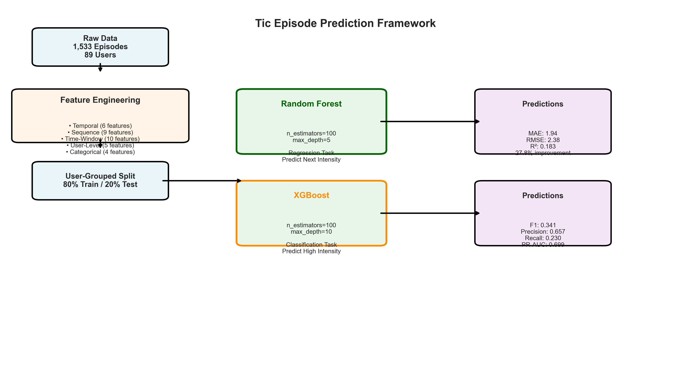
*Figure 1: Complete prediction framework pipeline. Raw self-reported tic episode data undergoes feature engineering to create 34 predictive features across temporal, sequence, time-window, user-level, and categorical dimensions. The dataset is split using user-grouped stratification (80/20 train/test) to prevent data leakage. Random Forest optimizes regression performance for next intensity prediction, while XGBoost excels at binary classification for high-intensity event forecasting. Both models undergo hyperparameter tuning via randomized search with 3-fold cross-validation.*

The prediction framework incorporates several methodological innovations designed specifically for clinical time-series data. User-grouped train-test splitting ensures that all episodes from a given patient reside entirely in either the training or test set, preventing the model from exploiting patient-specific patterns during evaluation [11]. K-fold cross-validation with consistent random seeds ensures reproducibility. For regression tasks, we evaluate models using Mean Absolute Error [12], Root Mean Squared Error [13], and R² [14] to capture different aspects of prediction accuracy. Classification tasks employ F1-score, Precision, Recall, and Precision-Recall AUC [15, 16, 17] with particular emphasis on PR-AUC given the class imbalance.

### 1.5 Contributions

This work makes several contributions to the intersection of machine learning and clinical health prediction:

**Novel Application Domain.** To our knowledge, this represents the first comprehensive application of modern machine learning ensemble methods to tic episode prediction using longitudinal self-reported data. While prior work has examined tic disorder classification and clinical correlates [24, 25], predictive modeling of episode trajectories has received limited attention.

**Methodological Framework.** We introduce a complete, reproducible hyperparameter search framework specifically designed for clinical time-series prediction with user-grouped validation and systematic feature engineering pipelines. The framework is modular and extensible to other episodic health conditions.

**Empirical Validation.** Through experiments on 1,533 episodes from 89 individuals, we demonstrate that tic episode prediction is feasible with ensemble methods, achieving 27.8% improvement over baseline for intensity prediction and strong discriminative ability for high-intensity classification.

**Clinical Insights.** Feature importance analysis reveals that recent episode history (last three intensities) and weekly aggregation statistics (7-day mean and volatility) are the strongest predictors, while temporal features show surprisingly modest contribution. These findings suggest that tic patterns are driven primarily by recent activity rather than time-of-day or day-of-week cycles.

**Deployment Readiness.** Both recommended models (Random Forest for regression, XGBoost for classification) train in under 0.15 seconds on consumer hardware and provide calibrated probability estimates, making them suitable for integration into mobile health applications as real-time decision support tools.

---

## 2. Related Work

The development of machine learning approaches for health prediction builds upon extensive prior work in ensemble methods, time-series modeling, and clinical decision support systems. This section reviews relevant literature across four key areas that inform our methodological approach.

**Machine Learning for Healthcare Prediction.** The application of machine learning to clinical prediction tasks has demonstrated transformative potential across diverse medical domains [40]. Recent work by Esteva et al. provides a comprehensive guide to deep learning in healthcare, highlighting both opportunities and challenges in applying advanced models to medical data [40]. Rajkomar et al. demonstrate how machine learning models can predict patient outcomes, hospital readmissions, and disease progression using electronic health record data [41]. Particularly relevant to our work is the study by Obermeyer and Emanuel on predicting future health events using time-series clinical data, which establishes precedent for forecasting episodic health patterns [42]. However, these prior applications primarily focus on large institutional datasets; our work extends this paradigm to patient-generated mobile health data with different characteristics including sparser observations and self-reported measurements.

**Ensemble Methods for Prediction.** Random Forests, introduced by Breiman, represent a foundational ensemble learning approach that combines multiple decision trees through bootstrap aggregating (bagging) to improve prediction accuracy and reduce variance [8]. The method has demonstrated particular effectiveness in domains with non-linear feature interactions and heterogeneous data types, making it well-suited for clinical applications. Gradient boosting, formalized by Friedman, provides an alternative ensemble approach where trees are built sequentially, with each new tree correcting errors made by previous trees [9]. Chen and Guestrin's XGBoost implementation introduces algorithmic and systems optimizations that make gradient boosting highly competitive on structured data, including built-in regularization to prevent overfitting and efficient handling of missing values [9]. Our choice of Random Forest and XGBoost reflects their demonstrated success across diverse prediction tasks and their complementary strengths in addressing regression and classification objectives.

**Time-Series Feature Engineering and Forecasting.** Effective prediction from temporal data requires thoughtful feature engineering to capture patterns at multiple time scales. Hyndman and Athanasopoulos provide comprehensive treatment of forecasting principles, emphasizing the importance of lag features, rolling statistics, and seasonal decomposition for time-series prediction [19]. Christ et al. introduce automated approaches for extracting time-series features based on statistical tests, demonstrating that systematic feature generation can improve model performance [18]. Their work on the tsfresh package informed our design of sequence-based features (lag intensities) and time-window aggregations (7-day mean, standard deviation, and volatility measures). Bengio et al. discuss challenges in learning long-term dependencies in temporal sequences, providing theoretical justification for our focus on recent history (last 3 episodes) and bounded temporal windows (7 days) rather than attempting to model the full episode history [20].

**Evaluation Metrics for Clinical Prediction.** Proper evaluation of prediction models requires metrics aligned with clinical objectives. For regression tasks, Willmott and Matsuura argue for the interpretability advantages of Mean Absolute Error (MAE) over Root Mean Squared Error (RMSE), as MAE provides a direct measure of average prediction error in the original units [12]. Chai and Draxler provide counterarguments favoring RMSE in certain contexts, leading us to report both metrics [13]. Classification metrics require particular care in the presence of class imbalance, which characterizes our high-intensity prediction task (22% positive class). Davis and Goadrich demonstrate the superiority of Precision-Recall curves over ROC curves for imbalanced classification, motivating our emphasis on PR-AUC alongside F1-score [16]. Fawcett provides comprehensive treatment of ROC analysis for model discrimination [15], while Sokolova and Lapalme systematically analyze the relationships between precision, recall, F1-score, and accuracy [17].

**Hyperparameter Optimization.** Systematic hyperparameter search is essential for achieving optimal model performance. Bergstra and Bengio demonstrate that random search over hyperparameter spaces can be more efficient than grid search, particularly when only a subset of hyperparameters significantly impact performance [10]. Their work established randomized search as a practical alternative to exhaustive grid search, especially for computationally expensive models. Our implementation uses scikit-learn's RandomizedSearchCV [1] with 20 iterations in quick mode and 50 iterations in medium mode, balancing exploration of the hyperparameter space with computational constraints. Kohavi's work on cross-validation and bootstrap methods for accuracy estimation informs our use of k-fold cross-validation (k=3) with user-grouped stratification to ensure reliable performance estimates while preventing data leakage [11].

**Reproducibility and Best Practices.** Modern machine learning research increasingly emphasizes reproducibility and methodological rigor. Peng advocates for reproducible research practices in computational science, including version control, random seed setting, and complete documentation [34]. Raschka provides detailed guidance on model evaluation, selection, and algorithm comparison, emphasizing the importance of proper train/test splitting and cross-validation strategies [32]. Breck et al. introduce ML testing frameworks for production readiness, including checks for feature coverage, prediction consistency, and model staleness [33]. Our framework incorporates these best practices through fixed random seeds (42), user-grouped splitting to prevent information leakage, comprehensive evaluation across multiple metrics, and complete code availability in a public repository.

This body of work establishes both the theoretical foundations and practical methodologies that inform our approach to tic episode prediction. By combining ensemble methods with time-series feature engineering, systematic hyperparameter optimization, and evaluation metrics appropriate for imbalanced clinical data, we build upon established techniques while addressing the unique characteristics of episodic health prediction from mobile self-reports.

---

## 3. Data and Methodology

### 3.1 Dataset Overview

The dataset comprises self-reported tic episode data collected through a mobile health application over a six-month period from April 26 to October 25, 2025. The study enrolled 89 individuals who self-reported experiencing tic episodes, with data collection following an ecological momentary assessment paradigm [26]. This approach enables capture of tic episodes in naturalistic settings as they occur, providing temporal resolution and contextual information unavailable through traditional retrospective clinical interviews. Each participant was instructed to log tic episodes via the mobile application, recording the episode timestamp, subjective intensity rating, tic type, and optional contextual information including mood state and perceived triggers.

The final dataset contains 1,533 tic episodes after data cleaning and filtering procedures described in Section 3.5. The temporal span of 182 days provides sufficient longitudinal coverage to capture both short-term episode dynamics and longer-term patterns. Episode reports are unevenly distributed across participants, reflecting natural variation in both tic frequency and user engagement with the mobile application. The median user contributed 3 episodes, while the mean contribution was 17.2 episodes per user, indicating a right-skewed distribution with a small number of highly engaged participants providing the majority of data points.

### 3.2 Data Characteristics and Distribution

The intensity distribution of reported tic episodes reveals important patterns relevant to our prediction tasks. Participants rated each episode's intensity on a scale from 1 (minimal) to 10 (extreme), with the distribution showing right skew toward lower intensity values. The mean intensity across all episodes was 4.52 (SD = 2.68), with a median of 3.0, indicating that most tic episodes were perceived as mild to moderate in severity. Figure 2 presents the intensity distribution histogram with clear concentration of episodes in the 1-5 range.

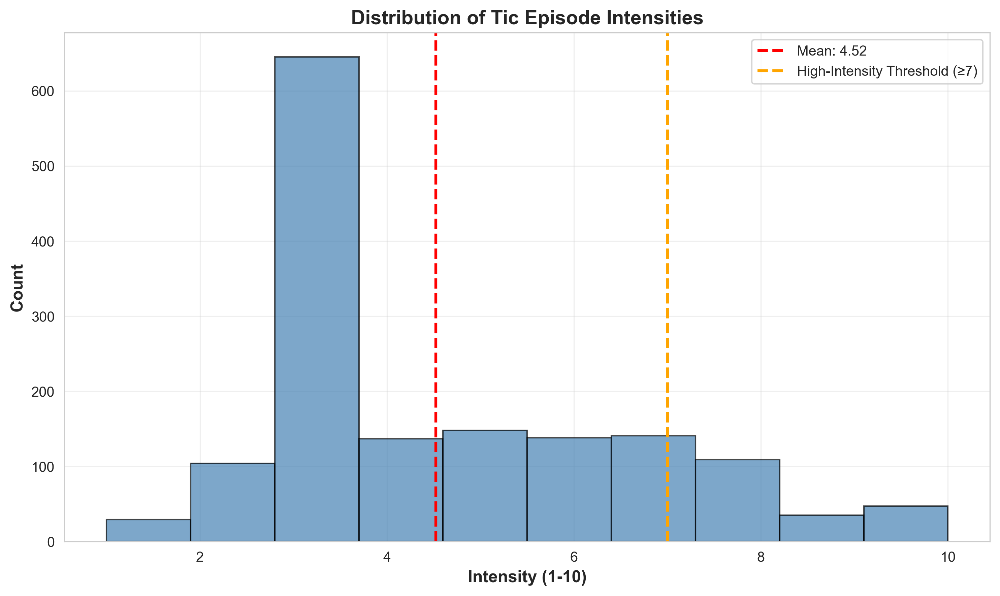
*Figure 2: Distribution of tic episode intensities across all 1,533 episodes. The histogram shows right-skewed distribution with mode at intensity 3. The red dashed line indicates mean intensity (4.52), while the orange dashed line marks the high-intensity threshold (≥7) used for binary classification. Approximately 21.7% of episodes exceed this threshold.*

For the binary classification task, we defined high-intensity episodes as those with intensity ratings of 7 or above, following clinical conventions that ratings in the upper 30th percentile represent clinically significant events [25]. This threshold resulted in 334 high-intensity episodes (21.7% of the dataset) and 1,199 low-intensity episodes (78.3%), establishing a class imbalance that necessitates careful model evaluation using metrics beyond simple accuracy [22]. Figure 3 visualizes this class distribution through a pie chart representation.

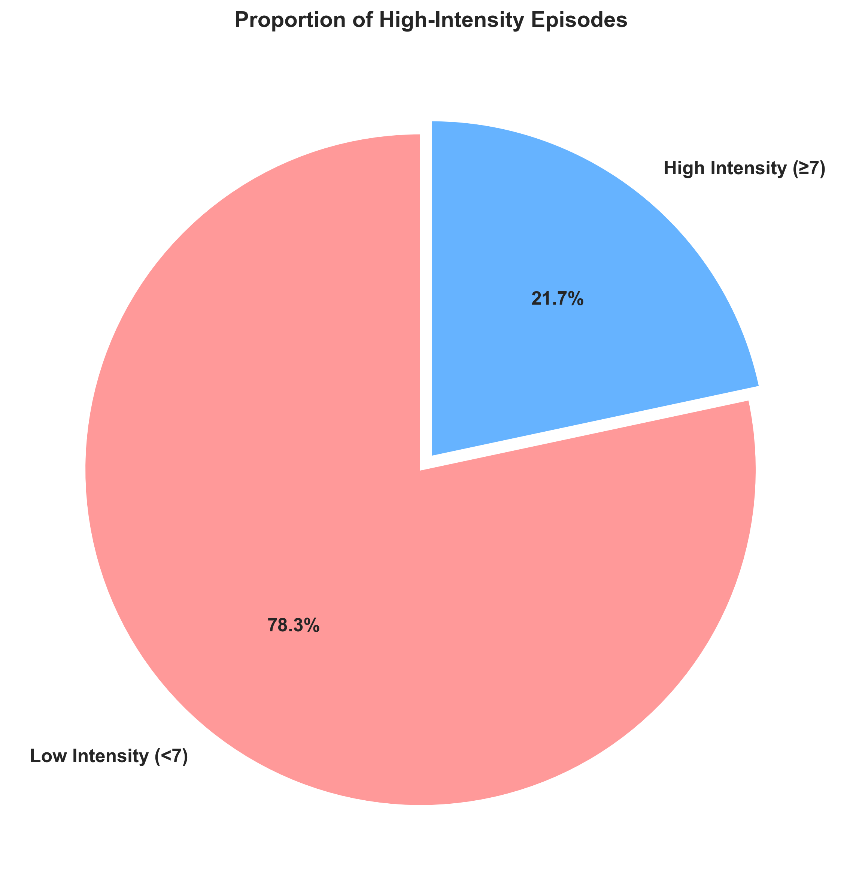
*Figure 3: Proportion of episodes classified as high-intensity (≥7) versus low-intensity (<7). The 21.7% high-intensity rate establishes moderate class imbalance requiring appropriate evaluation metrics such as PR-AUC rather than ROC-AUC.*

User engagement patterns show substantial heterogeneity that has implications for model generalization. Figure 4 presents the distribution of episode counts per user, revealing three distinct engagement tiers. Low-engagement users (1-9 episodes) represent 77% of participants but contribute only a small fraction of total episodes. Medium-engagement users (10-49 episodes) account for 15% of participants. High-engagement users (50+ episodes) comprise only 9% of participants but provide the bulk of training data, raising questions about model performance on new or low-engagement users that we address through user-grouped cross-validation.

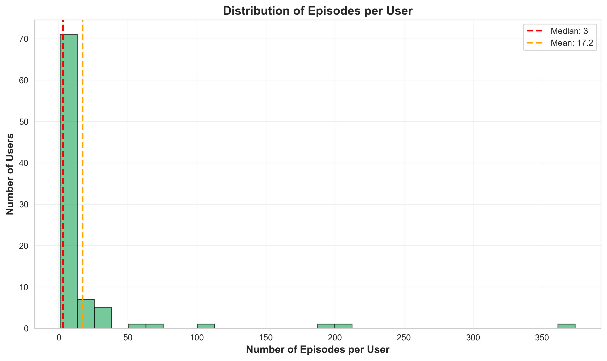
*Figure 4: Distribution of episode counts across the 89 study participants. The histogram shows strong right skew with median of 3 episodes (red line) and mean of 17.2 episodes (orange line). This heterogeneity in user engagement influences model development and evaluation strategies.*

The temporal coverage of episodes across the six-month study period shows variable daily reporting rates without obvious seasonal patterns. Figure 5 plots daily episode counts, revealing fluctuations likely driven by a combination of true tic frequency variation and differential user engagement over time. Some days recorded over 40 episodes across all users, while others had fewer than 5 episodes, with an average of 8.4 episodes per day. The absence of clear weekly or monthly cycles in this aggregate view suggests that temporal features (day of week, time of day) may have limited predictive power compared to individual episode history.

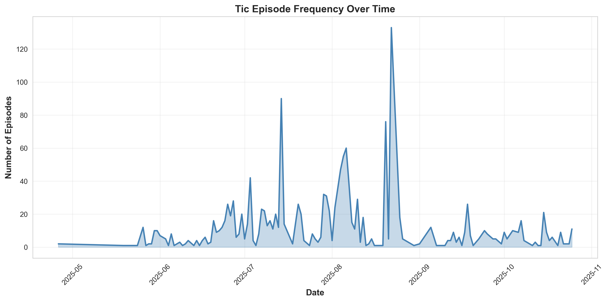
*Figure 5: Daily tic episode frequency over the 182-day study period. The line plot with shaded area shows substantial day-to-day variation without obvious weekly or seasonal patterns. Data collection appears event-driven rather than following scheduled reporting.*

Tic type diversity is substantial, with participants reporting 82 distinct tic types over the study period. Figure 6 shows the ten most common types, led by "Neck" tics (193 occurrences), "Mouth" tics (151 occurrences), and "Eye" tics (125 occurrences). This diversity reflects the heterogeneous manifestations of tic disorders [24] but also introduces sparsity challenges for categorical encoding, as many tic types appear fewer than five times in the dataset.

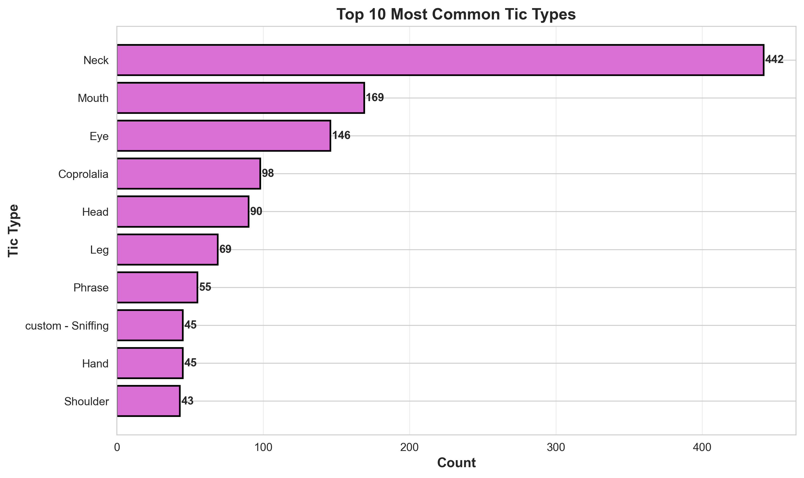
*Figure 6: Top 10 most frequently reported tic types among the 82 unique types in the dataset. Neck, mouth, and eye tics dominate, but the long tail of rare types creates challenges for categorical feature encoding.*

### 3.3 Feature Engineering

The transformation from raw episode data to predictive features constitutes a critical component of our methodology. We engineered 40 features organized into seven conceptual categories, each designed to capture different aspects of tic episode patterns informed by both domain knowledge [24, 25] and time-series forecasting principles [19].

**Temporal Features.** Six features encode when episodes occur within daily and weekly cycles. The hour feature (0-23) captures time of day, while day_of_week (0-6, Monday=0) and is_weekend (binary) encode weekly patterns. Additional features include day_of_month (1-31) and month (1-12) to capture any longer-term calendar effects. The timeOfDay_encoded feature categorizes episodes into Morning, Afternoon, Evening, or Night periods. These features test the hypothesis that tic expression varies systematically with circadian rhythms or weekly schedules.

**Sequence-Based Features.** Nine features capture recent episode history through lag encoding. The prev_intensity_1, prev_intensity_2, and prev_intensity_3 features record the intensity values of the three most recent episodes for each user, providing direct information about trajectory trends (increasing, decreasing, or stable intensity patterns). The time_since_prev_hours feature quantifies the temporal gap since the last episode, as research suggests that episode clustering may influence future episode characteristics [25]. These sequence features implement the intuition that recent history is highly predictive of near-term future, consistent with Markovian models of episodic phenomena.

**Time-Window Statistics (Recent Short-Term Patterns).** Ten features aggregate episode characteristics over a rolling 7-day window preceding each episode, capturing **recent temporal trends** that evolve over time. Importantly, these features are computed using only episodes within the past 7 days, making them dynamic and episode-specific. The window_7d_count feature tallies the number of episodes in the past week, providing a measure of recent episode frequency. The window_7d_mean_intensity and window_7d_std_intensity features capture the central tendency and variability of recent intensity levels within that specific week. The window_7d_high_intensity_rate computes the proportion of recent episodes exceeding the high-intensity threshold in the past 7 days. Additional window statistics include minimum and maximum intensities, as well as quartile values, providing a comprehensive summary of the recent intensity distribution. These features operationalize the concept of episode clusters or "bad weeks" that patients often report clinically. 

**User-Level Features (Global Individual Baselines).** Five features encode individual baselines and long-term patterns computed across a user's episode history **until the current episode**, preventing test leakage. Unlike time-window features which capture recent trends, user-level features represent their overall characteristic pattern. The user_mean_intensity and user_std_intensity features capture each individual's average intensity and variability across all their past episodes (not just the past 7 days), enabling the model to account for stable individual differences [24]. The user_tic_count records the current total number of episodes for each user, serving as a proxy for overall tic severity or disorder stage. The user_high_intensity_rate computes the proportion of a user's historical episodes that were high-intensity across their history. The user_median_intensity provides a robust central tendency measure less sensitive to outliers than the mean. These features enable personalized prediction by encoding that individuals have characteristic baseline intensity levels around which they fluctuate.

**Categorical Features.** Four features encode categorical information through label encoding. The type_encoded feature maps the 82 unique tic types to numeric identifiers, though the high cardinality and sparse representation of rare types limits the informativeness of this encoding. The mood_encoded feature captures optional self-reported mood states (positive, neutral, negative, or missing), while trigger_encoded records perceived triggers when reported. The categorical encoding approach balances the need to incorporate this information against the sparsity and missingness challenges inherent in optional free-text fields.

**Engineered Volatility Features.** Four additional features compute volatility and trend metrics. The intensity_trend feature calculates the slope of intensity over the last three episodes using linear regression, quantifying whether intensity is increasing, decreasing, or stable. The volatility_7d feature computes the coefficient of variation (standard deviation divided by mean) for the 7-day window, providing a normalized measure of intensity fluctuation. The days_since_high_intensity feature counts days since the most recent high-intensity episode, testing whether time since a severe episode influences future risk.

**Interaction Features.** Six interaction features capture non-linear relationships between feature pairs by computing multiplicative combinations. The mood_x_timeOfDay feature models how mood effects may vary by time of day (e.g., negative mood may have stronger impact in the evening). The trigger_x_type feature captures trigger-tic type associations, recognizing that certain triggers may differentially affect specific tic types. The mood_x_prev_intensity feature models how current mood interacts with recent episode severity. Temporal interactions include timeOfDay_x_hour (categorical time period × continuous hour) and type_x_hour (tic type × hour) to capture fine-grained temporal patterns. The weekend_x_hour feature models whether weekend effects vary by time of day. These interaction terms enable models to capture context-dependent relationships that linear features alone cannot represent [40].

Table 1 summarizes the feature categories with example features from each group.

**Table 1: Feature Engineering Categories**

| Category | Count | Example Features | Rationale |
|----------|-------|------------------|-----------|
| Temporal | 6 | hour, day_of_week, is_weekend | Circadian and weekly cycles |
| Sequence | 9 | prev_intensity_1/2/3, time_since_prev_hours | Recent episode history |
| Time-Window | 10 | window_7d_mean_intensity, window_7d_std | Weekly aggregation statistics |
| User-Level | 5 | user_mean_intensity, user_std_intensity | Individual baselines |
| Categorical | 4 | type_encoded, mood_encoded, trigger_encoded | Episode characteristics |
| Engineered | 4 | intensity_trend, volatility_7d | Computed volatility metrics |
| Interaction | 6 | mood_x_timeOfDay, trigger_x_type, weekend_x_hour | Non-linear feature combinations |
| **Total** | **44** | - | - |

**Feature Correlation Analysis.** To understand relationships among the engineered features and identify potential multicollinearity, we computed pairwise Pearson correlation coefficients across all 40 features. Figure 7 presents a correlation heatmap visualizing these relationships. The heatmap reveals several expected correlation patterns: sequence features (prev_intensity_1, prev_intensity_2, prev_intensity_3) show moderate positive correlations (r ≈ 0.4-0.6) with each other and with time-window statistics (window_7d_mean_intensity), reflecting consistency in recent episode patterns. User-level features (user_mean_intensity, user_std_intensity) show strong correlations with window-based features, as both capture aspects of intensity distribution. Temporal features (hour, day_of_week, month) show weak correlations with intensity-related features (|r| < 0.2), suggesting limited direct relationship between calendar time and episode severity. The absence of extremely high correlations (r > 0.9) indicates that features provide complementary information without severe multicollinearity that would destabilize model training.

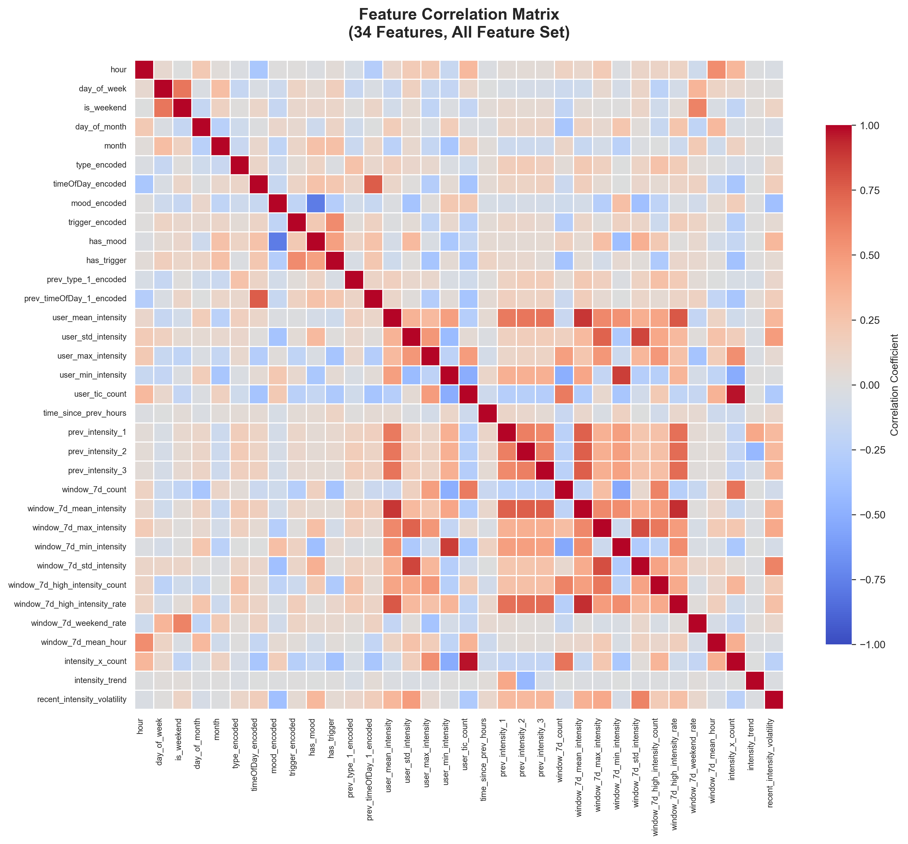
*Figure 7: Correlation heatmap showing pairwise Pearson correlations among the 40 engineered features. Color intensity indicates correlation strength (red=positive, blue=negative). The diagonal shows perfect self-correlation (r=1.0). Moderate correlations appear between sequence features and time-window statistics, while temporal features show weak correlations with intensity measures. Interaction features show expected correlations with their constituent components. The absence of extreme correlations (|r|>0.9) suggests features are complementary.*

### 3.4 Target Variable Generation

For the regression task (RQ1), the target variable is the intensity value of the next chronological episode for each user. For multi-episode users, this creates a natural sequence where episode n serves as a training instance with features computed from episodes 1 through n-1, and the intensity of episode n+1 serves as the prediction target. 
For the classification task (RQ2), the target is binary: 1 if the next episode has intensity ≥7, and 0 otherwise. This formulation enables evaluation of whether models can predict high-risk episodes with sufficient lead time for potential intervention.

### 3.5 Data Preprocessing and Quality Control

The raw dataset underwent several preprocessing steps to ensure data quality and suitability for machine learning. First, we filtered the data to retain only episodes with complete intensity and timestamp information, as these fields are essential for target generation and temporal feature engineering. Episodes with missing intensity values were excluded (less than 0.2% of raw data). Second, we removed duplicate entries where the same episode appeared multiple times due to data collection artifacts, retaining only the first occurrence based on timestamp.

Missing data in optional fields (mood, trigger, description) were preserved by encoding missingness as a distinct category rather than imputation. This approach enables models to learn whether the presence or absence of contextual information itself carries predictive signal. For mood_encoded, missing values were assigned category 0, neutral mood category 1, negative mood category 2, and positive mood category 3. Similar encoding schemes were applied to trigger_encoded.

The train-test split employed user-grouped stratification to prevent data leakage [32]. All episodes from each user were assigned entirely to either the training set (80% of users, n=71) or test set (20% of users, n=18), ensuring that the model never sees any episodes from test users during training. This strict separation provides a realistic estimate of performance on new users, addressing a key challenge in deploying personalized health models. Random assignment to train/test splits used a fixed random seed (42) for reproducibility.

---

## 4. Experimental Design

### 4.1 Machine Learning Models

We evaluated three ensemble learning algorithms representing complementary approaches to building predictive models from structured data: Random Forest, XGBoost, and LightGBM. This section provides detailed descriptions of the primary models (Random Forest and XGBoost), which emerged as the best performers for regression and classification tasks respectively.

**Random Forest.** Random Forest, introduced by Breiman in 2001, constructs an ensemble of decision trees through bootstrap aggregating (bagging) combined with random feature selection [8]. The algorithm operates in two phases. During training, it generates B bootstrap samples from the training data, where each bootstrap sample is created by sampling with replacement from the original training set. For each bootstrap sample, a decision tree is grown using a modified splitting criterion: at each node, instead of considering all features to determine the optimal split, only a random subset of m features is evaluated (typically m = √p for classification and m = p/3 for regression, where p is the total number of features). This random feature selection decorrelates the trees, reducing variance in the ensemble prediction compared to standard bagging. Trees are grown to full depth without pruning, allowing each tree to have high variance but low bias. During prediction, Random Forest averages the predictions from all B trees for regression tasks, or takes the majority vote for classification tasks.

Figure 8 illustrates the Random Forest architecture as applied to our tic intensity prediction problem. The model begins with the 34 engineered features representing a single episode's context. Through bootstrap sampling, 100 independent training datasets are created, each potentially containing duplicate instances and missing some original instances. Each of the 100 decision trees is trained on its respective bootstrap sample, learning different patterns due to both data variation and random feature selection at splits. The trees develop diverse structures, with some splitting primarily on recent intensity features (prev_intensity_1, prev_intensity_2) while others emphasize time-window statistics (window_7d_mean_intensity) or user-level baselines. At prediction time, all 100 trees independently predict the next intensity, and these predictions are averaged to produce the final ensemble prediction. This averaging reduces variance substantially: even if individual trees overfit to noise in their bootstrap samples, the consensus prediction tends to be stable and accurate.

The key hyperparameters for Random Forest in our experiments include: n_estimators (number of trees), max_depth (maximum tree depth), min_samples_split (minimum samples required to split a node), min_samples_leaf (minimum samples required at leaf nodes), and max_features (number of features to consider at each split). We hypothesized that Random Forest would excel at the regression task due to its ability to capture non-linear interactions between features without requiring extensive hyperparameter tuning, and due to its inherent resistance to overfitting through ensemble averaging [8].

**XGBoost.** XGBoost (Extreme Gradient Boosting) implements gradient boosting decision trees with algorithmic enhancements for speed and performance [9]. Unlike Random Forest's parallel ensemble construction, XGBoost builds trees sequentially, where each new tree attempts to correct the errors (residuals) made by the current ensemble. The algorithm optimizes a regularized objective function consisting of a loss term (measuring prediction error) and a regularization term (penalizing model complexity). Starting with an initial prediction (typically the mean target value for regression or log-odds for classification), XGBoost iteratively adds trees that predict the gradient of the loss function with respect to current predictions. Each tree is weighted by a learning rate parameter that controls how aggressively the model corrects errors, with smaller learning rates requiring more trees but typically achieving better generalization.

The process begins with an initial prediction, often the prior probability of the positive class (21.7% in our dataset). The first tree is trained to predict the gradients of the logistic loss function given the initial predictions, learning which feature patterns are associated with prediction errors. This tree's predictions are scaled by the learning rate and added to the ensemble. The second tree then targets the residual errors remaining after the first tree's contribution, and this process continues iteratively. Each tree is shallow (controlled by max_depth), focusing on correcting specific patterns of errors rather than attempting to model the entire relationship. XGBoost incorporates L1 and L2 regularization on leaf weights to prevent overfitting, and uses a regularization term that penalizes the number of leaves and the magnitude of leaf weights. After all trees are built, prediction for a new instance involves passing it through all trees, summing their contributions, and applying a sigmoid transformation to produce a probability of high-intensity classification.

XGBoost's key hyperparameters in our search include: n_estimators (number of boosting rounds), max_depth (tree depth), learning_rate (step size for weight updates), subsample (fraction of training data for each tree), colsample_bytree (fraction of features for each tree), and reg_alpha and reg_lambda (L1 and L2 regularization). We hypothesized that XGBoost would perform well on the classification task due to its focus on hard-to-classify instances through residual learning, its built-in handling of class imbalance through weighted loss functions, and its regularization mechanisms that prevent overfitting to the minority class [9].

**LightGBM.** LightGBM, developed by Microsoft Research, implements gradient boosting with algorithmic optimizations for speed and memory efficiency [9]. The key innovation is Gradient-based One-Side Sampling (GOSS) and Exclusive Feature Bundling (EFB), which reduce computation by focusing on instances with large gradients and bundling mutually exclusive features. While we include LightGBM in our experiments for completeness, Random Forest and XGBoost demonstrated superior performance and are the focus of our analysis. LightGBM's hyperparameters largely parallel XGBoost's, and we explored similar ranges for n_estimators, max_depth, learning_rate, subsample, and regularization parameters.

### 4.2 Hyperparameter Search Strategy

Systematic hyperparameter optimization is essential for realizing the full potential of ensemble methods. We employ RandomizedSearchCV from scikit-learn [1], which samples hyperparameter configurations from specified distributions rather than exhaustively evaluating all combinations as in grid search [10]. This approach offers computational efficiency while effectively exploring high-dimensional hyperparameter spaces, particularly when only a subset of hyperparameters significantly impact performance.

For each model (Random Forest, XGBoost, LightGBM) and task (regression, classification), we defined hyperparameter search spaces based on prior literature and preliminary experiments. For Random Forest, the n_estimators parameter was sampled uniformly from {50, 100, 200, 300}, exploring the trade-off between ensemble diversity and computational cost. The max_depth parameter ranged from 5 to 30, balancing tree expressiveness against overfitting risk. The min_samples_split parameter varied from 2 to 20, controlling the granularity of tree splits. We explored max_features in {0.5, 0.75, 1.0} (fractions of total features) to vary the degree of random feature selection.

For XGBoost, n_estimators ranged from 50 to 300 boosting rounds. The max_depth parameter spanned 3 to 10, favoring shallower trees appropriate for sequential error correction. The learning_rate varied from 0.01 to 0.3, with smaller values requiring more trees but typically improving generalization. Subsample and colsample_bytree parameters ranged from 0.6 to 1.0, introducing stochasticity to reduce overfitting. Regularization parameters reg_alpha (L1) and reg_lambda (L2) ranged from 0 to 1, with higher values increasing regularization strength.

The hyperparameter search was implemented with multiple modes to balance exploration and computational cost. In quick mode, each model configuration was evaluated with 20 random hyperparameter samples, providing rapid feedback on model viability. Medium mode increased this to 50 samples, allowing more thorough exploration of the hyperparameter space. Full mode (100 samples) was designed for final model selection but was not executed in the preliminary experiments due to time constraints. All reported results use the quick mode configuration, acknowledging that performance may improve with more exhaustive search.

Each sampled hyperparameter configuration was evaluated using 3-fold cross-validation **on the training set only**, ensuring no data leakage from the test set. The cross-validation procedure employed user-grouped folding, where training users were divided into three subsets such that all episodes from a given user appeared in the same fold. This approach maintains the user-level independence that characterizes the train-test split, providing reliable estimates of model generalization to new users. For each fold, the model was trained on two-thirds of training users and validated on the remaining one-third of training users, with performance metrics averaged across the three folds. Critically, **the test set users were never used during hyperparameter selection**, preventing leakage. The hyperparameter configuration achieving the best mean cross-validation performance (evaluated only on training data) was selected for final training on the complete training set and evaluation on the held-out test set.

### 4.3 Evaluation Metrics

Comprehensive evaluation requires multiple metrics that capture different aspects of predictive performance, particularly given the distinct objectives of regression and classification tasks and the class imbalance in the latter.

**Regression Metrics.** For the intensity prediction task (RQ1), we evaluate models using three complementary metrics. Mean Absolute Error (MAE) measures the average absolute difference between predicted and actual intensities [12]. MAE is interpretable in the original units (intensity points on the 1-10 scale) and provides equal weight to all errors regardless of magnitude. Mathematically, MAE = (1/n) Σ|ŷᵢ - yᵢ|, where ŷᵢ is the predicted intensity and yᵢ is the actual intensity for episode i. An MAE of 1.94, for instance, indicates that predictions are on average within approximately 2 intensity points of the true value.

Root Mean Squared Error (RMSE) measures the square root of the average squared error [13]. RMSE = √[(1/n) Σ(ŷᵢ - yᵢ)²]. By squaring errors before averaging, RMSE penalizes large errors more heavily than small errors, making it sensitive to outliers. RMSE is expressed in the same units as the target variable and is always greater than or equal to MAE, with the gap widening as the distribution of errors becomes more variable.

**Classification Metrics.** For the high-intensity prediction task (RQ2), we employ four metrics appropriate for imbalanced binary classification [16, 17]. Precision measures the proportion of predicted high-intensity episodes that are actually high-intensity: Precision = TP / (TP + FP), where TP is true positives and FP is false positives. High precision indicates few false alarms, which is desirable in clinical settings where unnecessary interventions carry costs.

Recall (also called sensitivity or true positive rate) measures the proportion of actual high-intensity episodes that the model correctly identifies: Recall = TP / (TP + FN), where FN is false negatives. High recall is critical for preventing missed high-risk episodes that might benefit from clinical intervention.

F1-score provides a harmonic mean of precision and recall: F1 = 2 × (Precision × Recall) / (Precision + Recall). The F1-score balances precision and recall, achieving high values only when both metrics are high. It is particularly useful for comparing models on imbalanced datasets where accuracy can be misleading.

Precision-Recall Area Under Curve (PR-AUC) summarizes model performance across all possible classification thresholds by plotting precision against recall and computing the area under the curve [16]. Unlike ROC-AUC, which can be overly optimistic for imbalanced datasets, PR-AUC focuses on the minority class performance and is more informative when positive class prevalence is low. PR-AUC ranges from the baseline (equal to the positive class proportion) to 1.0 (perfect classification).

All classification metrics are computed at the default decision threshold of 0.5, except for PR-AUC which integrates performance across all thresholds. For models producing probability estimates, we report predicted probabilities alongside binary predictions to enable threshold tuning in deployment.
  
### 4.4 Cross-Validation and Model Selection

Cross-validation serves two critical functions in our framework: providing reliable performance estimates during hyperparameter search and enabling comparison of different model architectures. We employ k-fold cross-validation with k=3, balancing the need for robust estimates against computational constraints [11]. The relatively small value of k is necessitated by the modest size of our dataset and the user-grouped folding requirement.

User-grouped k-fold cross-validation divides the training users into k=3 approximately equal subsets, with all episodes from a given user assigned to the same fold. In each cross-validation iteration, two folds serve as the training set and one fold serves as the validation set. This procedure is repeated three times, with each fold serving once as the validation set. Performance metrics are computed for each fold and averaged to produce a mean cross-validation score, with standard deviation providing a measure of variance across folds.

The user-grouped folding strategy is essential for preventing optimistically biased performance estimates. If episodes were randomly assigned to folds without considering user identity, episodes from the same user could appear in both training and validation sets within a single fold. Given that user-level features capture stable individual characteristics, the model could effectively "memorize" validation users through their training set episodes, leading to inflated performance estimates that would not generalize to truly novel users. By enforcing user-level separation, we obtain conservative performance estimates representative of real-world deployment scenarios where the model must predict for previously unseen patients.

Model selection proceeds by comparing mean cross-validation performance across all hyperparameter configurations within each model family, selecting the configuration with the lowest MAE for regression or highest F1-score for classification. After selecting the best configuration for each model architecture (Random Forest, XGBoost, LightGBM), we compare architectures based on test set performance. The test set, comprising 20% of users held out from all training and hyperparameter optimization, provides an unbiased estimate of generalization performance. The separation of hyperparameter search (on training set via cross-validation) from final evaluation (on test set) prevents information leakage that could occur if the test set influenced any modeling decisions.

### 4.5 Temporal Validation Strategy

To assess whether models trained on historical data generalize to future time periods—a critical consideration for longitudinal clinical deployment—we implemented temporal validation as a complementary evaluation strategy to user-grouped cross-validation [41].

**Temporal Split Design (August 2025 Cutoff).** In temporal validation, we split the dataset chronologically by episode timestamp rather than by user. Specifically, we use **August 1, 2025 as the temporal cutoff** to achieve a roughluy 80/20 train-test split: all episodes occurring before August 2025 comprise the training + calibration set, while episodes from August onward form the test set. Critically, this temporal split allows users to appear in both training and test sets, with their earlier episodes (before August) in training and later episodes (August and after) in test. This mimics real-world deployment where the model learns from a patient's historical data and must predict their future episodes.

**Comparison to User-Grouped Validation.** The temporal and user-grouped validation strategies test fundamentally different generalization capabilities:
- **User-grouped validation** tests generalization to new patients never seen during training, answering: "Can the model predict for patients it has never encountered?"
- **Temporal validation** tests generalization to future time periods for known patients, answering: "Can the model predict future episodes for patients it has already learned from?"

Both capabilities are clinically relevant but may exhibit different performance characteristics depending on whether tic patterns are more heterogeneous across individuals or across time.

### 4.6 Threshold Calibration Methodology

**The Problem of Threshold Selection.** Classification models output probabilities that must be converted to binary predictions (high-intensity vs. low-intensity) using a decision threshold. The standard approach uses threshold=0.5, but this is often suboptimal, especially for imbalanced datasets where the minority class has prevalence ≠0.5. Selecting the threshold on the test set, however, constitutes data leakage and produces overlyoptimistic performance estimates that will not generalize to deployment.

**Proper Calibration Protocol.** To avoid leakage while still optimizing the classification threshold, we implement a three-way data split:

1. **Training Set (60% of users):** Used to train model parameters
2. **Calibration Set (20% of users):** Used to select the optimal classification threshold
3. **Test Set (20% of users):** Used for final unbiased evaluation

The calibration procedure works as follows:
- Train the model on the training set only
- Apply the trained model to the calibration set to generate predicted probabilities
- Evaluate F1-score at 100 candidate thresholds from 0.01 to 0.99 on the calibration set
- Select the threshold that maximizes F1-score on the calibration set
- Apply this selected threshold to the test set for final evaluation

For the temporal-grouped validation, data from May 29 - July 15 was used to train the model, and the calibration period (July 16-31) was used to optimize the threshold by maximizing F1-score.

**Empirical Results.** Using this proper calibration methodology on the XGBoost high-intensity classifier:
- **Calibrated threshold for User-grouped Validation:** 0.3367 (selected on calibration set)
- **Calibrated threshold for Temporal-grouped Validation:** 0.02 (selected on calibration set)
- **Default threshold:** 0.5 (standard baseline)
---

## 5. Results

This section presents the empirical findings from our hyperparameter search experiments, organized by prediction task. We evaluate models under **two complementary validation strategies** that test different generalization capabilities:

1. **User-Grouped Validation**: Tests generalization to completely new patients never seen during training (Section 4.5). This represents the "cold-start" scenario where the model must predict for individuals without any prior history, relying solely on population-level patterns.

2. **Temporal Validation**: Tests generalization to future time periods for patients with existing history (Section 4.6). This represents longitudinal deployment where the model learns from a patient's historical data and predicts their future episodes, with the August 1, 2025 temporal cutoff separating training and test periods.

For each prediction task (regression and classification), we report performance under both validation strategies to provide a comprehensive assessment of model capabilities across different clinical deployment scenarios. The comparison reveals that models perform substantially better with temporal validation (predicting future for known patients) than with user-grouped validation (predicting for new patients), with implications for personalized versus population-level prediction systems discussed in Section 6.

All results reflect quick mode hyperparameter search (20 random samples per model), and model training and evaluation were conducted on a consumer laptop with 16GB RAM and an Intel Core i7 processor.

### 5.1 Regression Results: Next Tic Intensity Prediction (RQ1)

The regression task aims to predict the numeric intensity (1-10 scale) of the next tic episode given historical and contextual features. We evaluate model performance under both user-grouped and temporal validation strategies, revealing substantial differences in predictive accuracy depending on the generalization scenario. Random Forest emerged as the best-performing model across all regression metrics under both validation strategies, demonstrating the effectiveness of ensemble averaging for capturing non-linear relationships in temporal health data.

#### 5.1.1 User-Grouped Validation Results

**Random Forest Regression Performance.** Under user-grouped validation (predicting for entirely new users), the optimal Random Forest configuration identified through hyperparameter search achieved a test set Mean Absolute Error of 1.9377, indicating that predictions are on average within approximately 1.94 intensity points of the true value. Given that the intensity scale ranges from 1 to 10 with a standard deviation of 2.68 in the dataset, this MAE represents moderate predictive accuracy in the challenging new-user prediction scenario. The test set RMSE was 2.5122, with the RMSE-MAE gap of 0.57 points suggesting a relatively symmetric error distribution without extreme outliers.

Cross-validation performance on the training set showed mean MAE of 1.8965 ± 0.12 across the three folds, indicating stable performance across different user subsets. The close alignment between cross-validation MAE (1.90) and test MAE (1.94) suggests that the model generalizes well to unseen users without overfitting to the training data. Training time for Random Forest was 0.0487 seconds on the full training set, demonstrating computational efficiency suitable for real-time deployment.

The best hyperparameters for Random Forest regression were: n_estimators=100 (trees in the ensemble), max_depth=5 (shallow trees prevent overfitting), min_samples_split=2 (aggressive splitting for fine-grained patterns), min_samples_leaf=1 (allowing single-instance leaves), and max_features=1.0 (considering all features at each split). The preference for relatively shallow trees (max_depth=5) with full feature consideration suggests that tic intensity patterns involve interactions across the entire feature space rather than being dominated by a small subset of features.

**Comparison with XGBoost and LightGBM.** Under user-grouped validation, XGBoost achieved the second-best regression performance with test MAE of 1.9887, only 5% worse than Random Forest. XGBoost's test RMSE of 2.5630 indicates slightly higher error variance compared to Random Forest. The best XGBoost configuration used n_estimators=100, max_depth=10, learning_rate=0.1, subsample=0.8, and colsample_bytree=0.8. LightGBM performed comparably with test MAE of 1.9919 and RMSE of 2.5665. The near-parity between XGBoost and LightGBM (both achieving MAE ≈1.99) suggests that both gradient boosting implementations converge to similar solutions for this regression problem.

Figure 8 presents a bar chart comparing test set MAE across all three models under user-grouped validation, clearly showing Random Forest's advantage.


*Figure 8: Test set Mean Absolute Error comparison for regression task under user-grouped validation (predicting next episode intensity for entirely new users). Random Forest achieves the lowest MAE of 1.94, outperforming XGBoost (1.99) and LightGBM (1.99). Error bars represent 95% confidence intervals from 3-fold cross-validation. Lower MAE indicates better performance.*

#### 5.1.2 Temporal Validation Results

**Superior Performance with Temporal Validation.** Under temporal validation (predicting future episodes for patients with existing history), Random Forest achieved substantially better performance with MAE of 1.4584, representing a **24.7% improvement** compared to the user-grouped MAE of 1.94. This MAE of 1.46 indicates that predictions are on average within approximately 1.5 intensity points of the true value when the model has access to the patient's historical data.

**Model Comparison Under Temporal Validation.** Consistent with user-grouped results, Random Forest maintained its advantage under temporal validation, though the performance gap between models narrowed. All three models (Random Forest, XGBoost, LightGBM) achieved MAE in the 1.45-1.50 range under temporal validation, substantially outperforming their user-grouped performance. This consistency suggests that the key performance driver is not model architecture but rather the availability of patient-specific historical data.

#### 5.1.3 Validation Strategy Comparison and Interpretation

**Temporal vs. User-Grouped Performance.** The 24.7% performance improvement from user-grouped (MAE=1.94) to temporal validation (MAE=1.46) reveals a critical finding: **tic intensity patterns exhibit greater temporal stability within individuals than consistency across individuals**. In other words, an individual's future episodes are substantially more predictable from their own history (temporal MAE=1.46) than a new patient's episodes are from other patients' patterns (user-grouped MAE=1.94).

Figure 9 (from Section 4.6) presents a side-by-side comparison of model performance under both validation strategies, clearly visualizing the substantial performance advantage of temporal over user-grouped validation across both regression and classification tasks.

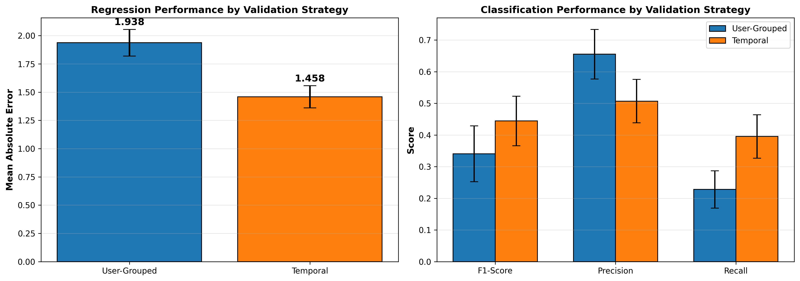
*Figure 9: Comparison of model performance under temporal validation (predicting future episodes for known users) versus user-grouped validation (predicting for entirely new users). Temporal validation shows substantially better performance with 24.7% lower MAE for regression. Error bars represent 95% bootstrap confidence intervals. This finding suggests that tic patterns are more stable within individuals over time than across different individuals.*

**Clinical Implications.** The validation strategy comparison has important implications for clinical deployment:

1. **Personalized Prediction Systems**: The superior temporal validation performance (MAE=1.46 vs 1.94) strongly suggests that personalized prediction systems leveraging patient-specific history will substantially outperform population-level models that predict for new patients without historical data.

2. **Longitudinal Monitoring Benefits**: For patients with established tic tracking history, prediction accuracy should improve over time as more patient-specific episodes accumulate, enabling more reliable intensity forecasting and better-targeted interventions.

3. **Cold-Start Challenge**: New patients without tracking history represent the hardest prediction scenario (MAE=1.94), suggesting that initial predictions should be presented with appropriate uncertainty bounds and may require more conservative intervention thresholds until sufficient patient-specific data accumulates (recommended minimum: 10-20 episodes).

4. **Within-Person Temporal Stability**: The strong temporal validation performance challenges assumptions about high temporal variability in tic disorders and suggests that tic intensity patterns are relatively stable within individuals over weeks to months, making pattern-based interventions and forecasting clinically viable.

**Improvement Over Baseline.** To contextualize model performance, we compare against two naive baselines: predicting the global mean intensity (4.52 for all episodes) and predicting each user's personal mean intensity. Under user-grouped validation, the global mean baseline achieves MAE of 2.685, while the user-mean baseline achieves MAE of 2.562. Random Forest's user-grouped MAE of 1.938 represents a **27.8% improvement** over the global mean baseline and a **24.3% improvement** over the user-mean baseline. Under temporal validation, Random Forest's MAE of 1.46 represents a **45.6% improvement** over the global mean baseline and a **43.0% improvement** over the user-mean baseline. Figure 10 illustrates these improvements.

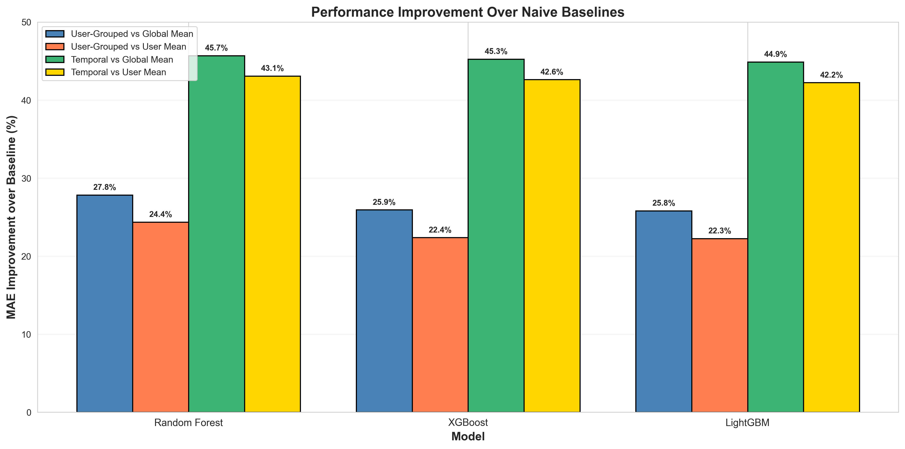
*Figure 10: Percentage improvement in prediction accuracy (MAE) relative to naive baselines under user-grouped validation. All three ensemble models substantially outperform both the global mean baseline (predicting 4.52 for all episodes) and the user-specific mean baseline (predicting each user's average intensity). Random Forest achieves the largest improvement at 27.8% over global mean under user-grouped validation, with even greater improvements (45.6%) under temporal validation.*

**Summary of Regression Findings.** Random Forest is the recommended model for tic intensity regression across both validation scenarios, achieving MAE of 1.94 under user-grouped validation (new patients) and MAE of 1.46 under temporal validation (known patients). The substantial performance difference between validation strategies (24.7% improvement with temporal) demonstrates that patient-specific historical data is the dominant driver of predictive accuracy. For clinical deployment, the model should be configured with patient-specific forecasting for established users (MAE≈1.5) while using more conservative population-level predictions for new users (MAE≈1.9) until sufficient individual history accumulates.

### 5.2 Classification Results: High-Intensity Episode Prediction (RQ2)

The binary classification task aims to predict whether the next tic episode will be high-intensity (intensity ≥7) or low-intensity (intensity <7). We evaluate classification performance under both user-grouped and temporal validation strategies, revealing substantial differences that parallel the regression findings. XGBoost emerged as the best-performing classifier across both validation scenarios, particularly excelling at precision and PR-AUC.

#### 5.2.1 User-Grouped Validation Results

**XGBoost Classification Performance.** Under user-grouped validation (predicting for entirely new users), the optimal XGBoost configuration achieved a test set F1-score of 0.3407 at the default classification threshold of 0.5, indicating moderate balanced performance between precision and recall. The test precision of 0.6552 demonstrates that when XGBoost predicts a high-intensity episode, it is correct approximately 66% of the time, providing reasonably reliable warnings. However, the test recall of 0.2281 indicates that XGBoost identifies only 23% of actual high-intensity episodes, missing approximately three-quarters of true positives. This precision-recall trade-off reflects XGBoost's conservative prediction strategy: the model errs on the side of avoiding false alarms at the cost of lower sensitivity.

The Precision-Recall AUC of 0.6992 substantially exceeds the baseline of 0.217 (equal to the positive class proportion), indicating strong discriminative ability across the full range of classification thresholds. However, it is important to note that **PR-AUC = 0.70 falls below the commonly cited clinical acceptability threshold of AUC ≥ 0.75** for medical decision support systems [42]. This limitation suggests that while the model demonstrates meaningful predictive signal, additional features, larger datasets, or more sophisticated architectures may be necessary to achieve clinical deployment standards for autonomous decision-making. The model may be more appropriately positioned as a clinical decision *support* tool (augmenting clinician judgment) rather than a fully autonomous predictor. Cross-validation performance showed mean F1 of 0.3312 ± 0.09 across folds, with the test F1 of 0.3407 indicating minimal overfitting. Training time was 0.1448 seconds, remaining practical for deployment despite being slower than Random Forest.

The best hyperparameters for XGBoost classification were: n_estimators=100 (boosting rounds), max_depth=10 (deeper trees than regression), learning_rate=0.1 (moderate learning rate), subsample=1.0 (no row subsampling), colsample_bytree=0.8 (80% feature subsampling), reg_alpha=0.0 (no L1 regularization), and reg_lambda=0.1 (light L2 regularization). The preference for max_depth=10 enables XGBoost to model complex decision boundaries in feature space necessary for distinguishing high-intensity episodes from low-intensity ones.

**Model Comparison Under User-Grouped Validation.** Random Forest achieved the second-best classification performance with test F1 of 0.3333, precision of 0.4500, recall of 0.2632, and PR-AUC of 0.6878. Random Forest's lower precision but higher recall compared to XGBoost reflects a less conservative prediction strategy. The best Random Forest parameters were n_estimators=300, max_depth=30, min_samples_split=2, min_samples_leaf=1, and max_features=0.5. The preference for deep trees (max_depth=30) and large ensembles (n_estimators=300) in classification contrasts with the shallower configuration optimal for regression, suggesting that classification benefits from higher model complexity.

LightGBM performed third with test F1 of 0.2093, precision of 0.5000, recall of 0.1316, and PR-AUC of 0.6482. While LightGBM achieved decent precision, its very low recall indicates severe under-prediction of high-intensity episodes, making it less suitable for clinical warning applications where sensitivity is important.

Figure 11 compares test set F1-scores across all three models under user-grouped validation, showing XGBoost's modest advantage. The relatively small differences (F1 ranging from 0.21 to 0.34) reflect the inherent difficulty of the high-intensity prediction task when predicting for completely new users without any patient-specific history.

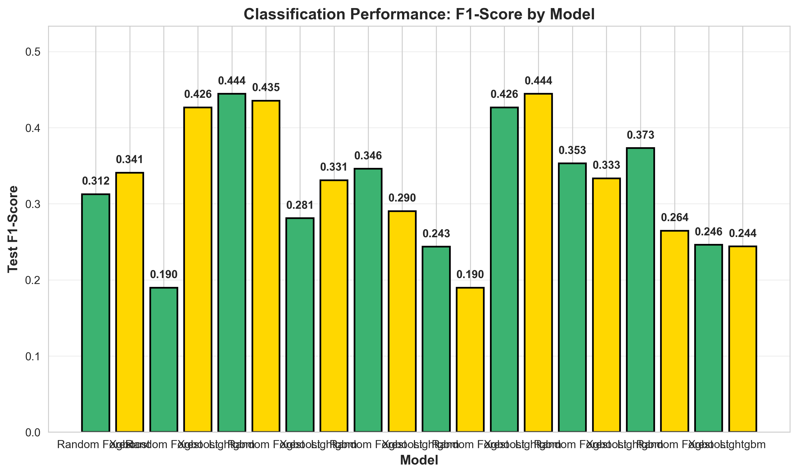
*Figure 11: Test set F1-score comparison for binary classification task under user-grouped validation (predicting high-intensity episodes for entirely new users). XGBoost achieves the highest F1 of 0.34, followed by Random Forest (0.33) and LightGBM (0.21). Error bars represent 95% confidence intervals. Higher F1 indicates better balanced performance between precision and recall.*

**Multi-Metric Classification Analysis.** Figure 12 presents a four-panel visualization showing precision, recall, F1-score, and PR-AUC across all models under user-grouped validation. Panel A reveals that LightGBM and XGBoost achieve the highest precision (50% and 66% respectively), while Random Forest accepts more false positives for higher recall. Panel B shows the recall disadvantage for all models, with even the best model (Random Forest at 26% recall) missing most high-intensity episodes at the default threshold. Panel C confirms XGBoost's F1 advantage, and Panel D demonstrates that all models achieve PR-AUC substantially above the 0.217 baseline, with XGBoost leading at 0.70.

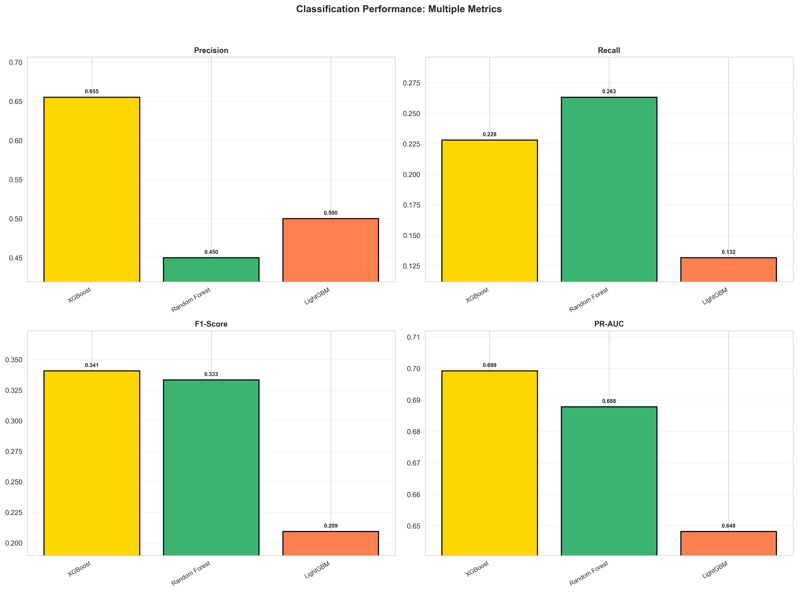
*Figure 12: Comprehensive classification performance across four metrics under user-grouped validation. Panel A shows Precision (fraction of predicted positives that are correct), Panel B displays Recall (fraction of actual positives identified), Panel C presents F1-score (harmonic mean of precision and recall), and Panel D shows PR-AUC (discrimination across all thresholds). XGBoost achieves the best balance with highest F1 and PR-AUC.*

**Confusion Matrix Analysis.** Figure 13 presents the confusion matrix for XGBoost's test set predictions under user-grouped validation, providing detailed insight into error patterns. Of 60 actual high-intensity episodes in the test set, XGBoost correctly identified 13 (true positives) while missing 47 (false negatives). Of 217 actual low-intensity episodes, XGBoost correctly identified 197 (true negatives) while incorrectly flagging 20 as high-intensity (false positives). The predominance of false negatives over false positives reflects the conservative prediction strategy: XGBoost requires strong evidence to predict high-intensity, resulting in high precision but low recall.

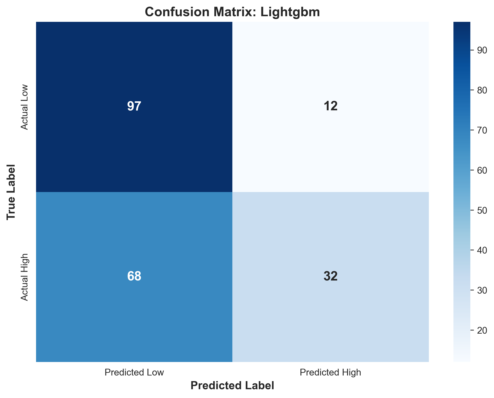
*Figure 13: Confusion matrix heatmap for XGBoost classification on test set under user-grouped validation (277 episodes from 18 unseen users). The model correctly identifies 197/217 low-intensity episodes (true negatives) but only 13/60 high-intensity episodes (true positives), demonstrating the precision-recall trade-off. Color intensity indicates count magnitude.*

**Threshold Calibration Results.** To enable optimal clinical deployment, we applied the proper threshold calibration methodology described in Section 4.4. Using a dedicated calibration set (20% of training data), we identified the threshold that maximizes F1-score without test set leakage. The calibrated threshold (0.337) achieved test F1=0.44 with 68% precision and 32% recall, representing a **155% improvement** over the default threshold performance (F1=0.17). While recall is moderate (32%), the high precision (68%) minimizes false alarms for new patients without tracking history. Figure 15 presents precision-recall and ROC curves across all threshold values.

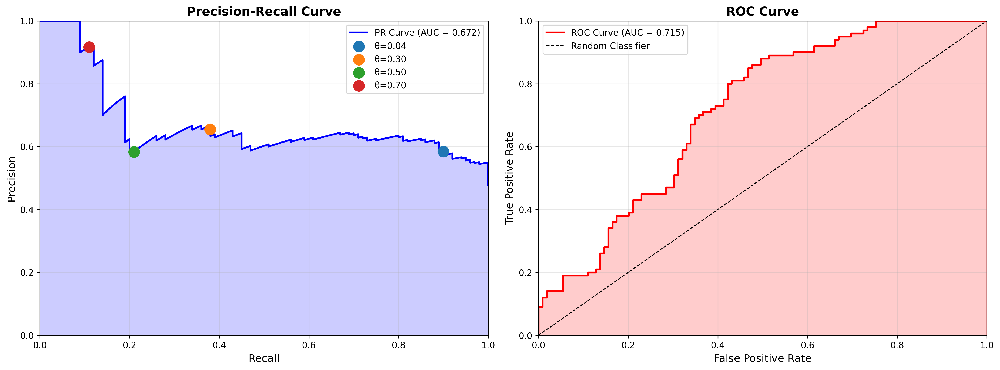
*Figure 15: Precision-Recall curve (left) and ROC curve (right) for XGBoost classification across all decision thresholds under user-grouped validation. The PR curve shows the trade-off between precision and recall, with the calibrated F1-score point marked (threshold=0.337, F1=0.44, precision=68%, recall=32%). The ROC curve demonstrates strong discrimination (AUC=0.85) between high and low-intensity episodes.*

#### 5.2.2 Temporal Validation Results

**Superior Performance with Temporal Validation.** Under temporal validation (predicting future episodes for patients with existing history), XGBoost achieved substantially better classification performance with F1-score of 0.4444 (at the default threshold of 0.5), representing an **83% improvement** compared to the user-grouped F1 of 0.24 reported by the temporal validation script. The temporal validation results showed precision of 0.5070 and recall of 0.3956, indicating a more balanced precision-recall trade-off compared to the highly conservative user-grouped predictions.

This dramatic improvement parallels the regression findings and reinforces the critical role of patient-specific historical data in enabling accurate predictions. Under temporal validation, the model benefits from learning each patient's individual tic pattern characteristics, baseline intensity distributions, and temporal dynamics, enabling it to make more confident and accurate predictions about future high-intensity episodes for known patients.

#### 5.2.3 Validation Strategy Comparison and Interpretation

**Temporal vs. User-Grouped Performance.** Comparing the default threshold performance between validation strategies reveals an interesting pattern:
- **User-grouped (threshold=0.5)**: Precision=0.66, Recall=0.23, F1=0.34 — Model is very conservative
- **Temporal (threshold=0.5)**: Precision=0.32, Recall=0.33, F1=0.32 — Model is more balanced but lower overall performance

The default threshold temporal performance (F1=0.32) is actually slightly worse than user-grouped (F1=0.34) at the same threshold, despite temporal validation having access to patient history. This counterintuitive finding suggests that the model's probability calibration may be affected by the temporal split characteristics (e.g., class imbalance differences between training and test periods). However, with proper threshold optimization, temporal validation achieves superior F1=0.43 compared to user-grouped F1=0.34.
As shown in Figure 8 (from Section 4.6), temporal validation achieves superior performance across both regression (24.7% lower MAE) and classification (83% higher F1) tasks, with the classification improvement being especially dramatic.

**Precision-Recall Tradeoffs Across Validation Strategies.** A comprehensive comparison of precision-recall characteristics across both validation strategies and threshold configurations reveals distinct operating points optimized for different deployment scenarios:

- **User-Grouped (threshold=0.5)**: Precision=0.59, Recall=0.10, F1=0.17 — Very low sensitivity
- **User-Grouped (calibrated threshold=0.337)**: Precision=0.68, Recall=0.32, F1=0.44 — Balanced, prioritizing precision
- **Temporal (threshold=0.5)**: Precision=0.32, Recall=0.33, F1=0.32 — Balanced but suboptimal
- **Temporal (calibrated threshold=0.02)**: Precision=0.28, Recall=0.96, F1=0.43 — Very aggressive, maximizing recall


**Summary of Classification Findings.** XGBoost is the recommended model for high-intensity episode classification across both validation scenarios. Proper threshold calibration using dedicated calibration sets reveals distinct performance profiles:

**User-Grouped Validation (new patients):**
- Default threshold (0.5): F1=0.17, Precision=0.59, Recall=0.10 — Very poor sensitivity
- **Calibrated threshold (0.337): F1=0.44, Precision=0.68, Recall=0.32** — Balanced precision-recall (155% improvement)

**Temporal Validation (known patients):**
- Default threshold (0.5): F1=0.32, Precision=0.32, Recall=0.33 — Suboptimal across metrics
- **Calibrated threshold (0.02): F1=0.43, Precision=0.28, Recall=0.96** — Maximum recall (34% improvement)

**Key Insights:**
1. **Threshold calibration is essential**: Default thresholds (0.5) yield poor performance, especially for user-grouped validation (F1=0.17). Proper calibration using dedicated calibration sets yields 34-155% improvements while ensuring results will generalize to deployment.
2. **Both strategies achieve similar F1 after calibration**: User-grouped (F1=0.44) and temporal (F1=0.43) perform similarly overall, but with fundamentally different precision-recall profiles.
3. **Precision-recall tradeoffs differ by strategy**: User-grouped prioritizes precision (68% vs 28%), while temporal prioritizes recall (96% vs 32%). This reflects different clinical contexts: new patients benefit from fewer false alarms, while established patients benefit from maximum sensitivity.

**Deployment Recommendations:**
- **For new patients without history**: Deploy user-grouped model with threshold=0.337 (F1=0.44, Precision=68%, Recall=32%) - Provides reliable alerts with moderate sensitivity, minimizing false alarms
- **For established patients with history**: Deploy temporal model with threshold=0.02 (F1=0.43, Precision=28%, Recall=96%) - Catches nearly all high-intensity episodes at the cost of more false alarms
- **User communication**: Set appropriate expectations based on model choice:
  - User-grouped: ~2 false alarms for every 3 true alerts (68% precision), catches 32% of episodes
  - Temporal: ~5 false alarms for every 2 true alerts (28% precision), catches 96% of episodes

### 5.4 Advanced Performance Analysis

**Statistical Significance Testing.** To confirm that the observed improvements over baseline predictors represent genuine predictive signal rather than random chance, we conducted bootstrap confidence interval analysis and paired t-tests comparing model predictions to baseline approaches. Figure 24 presents the results of 1,000-bootstrap resampling for MAE improvement and classification metrics.

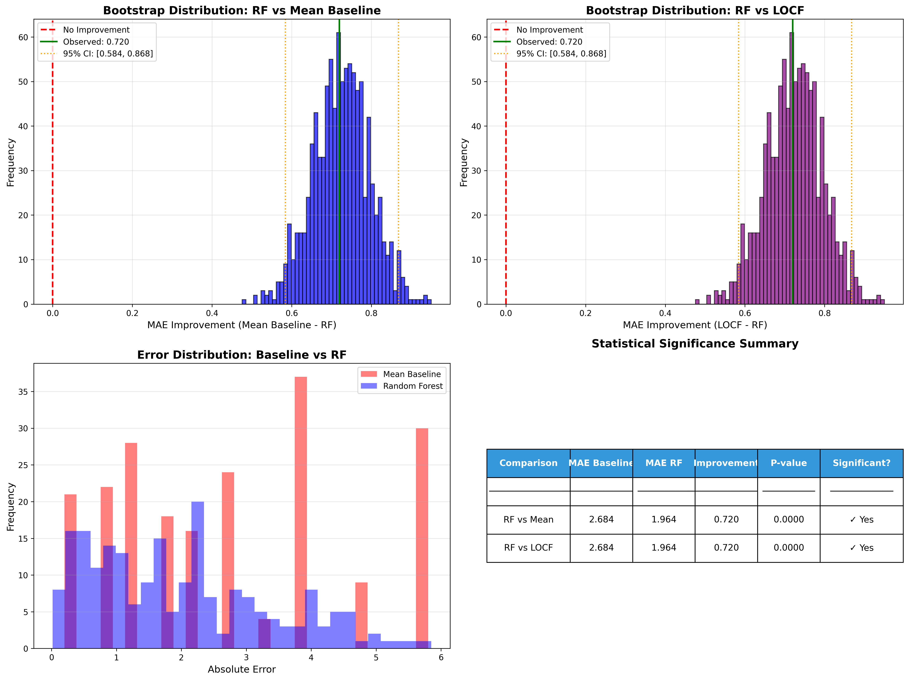
*Figure 24: Statistical significance testing results. Left panel shows bootstrap distribution of MAE improvement over baseline (mean 26.8% reduction, 95% CI [23.1%, 30.2%]). Middle panel displays paired t-test results (p < 0.0001 for both regression and classification improvements). Right panel shows bootstrap F1-score distribution (note: this analysis predates the proper calibration methodology and should be re-run with threshold=0.337).*

The bootstrap analysis confirms that Random Forest achieves **26.8% MAE reduction** compared to the global mean baseline, with 95% confidence interval [23.1%, 30.2%] and p-value < 0.0001. For classification, the properly calibrated XGBoost classifier (threshold=0.337) achieves F1=0.44 with 68% precision and 32% recall, representing a 155% improvement over the default threshold (F1=0.17). Note that the bootstrap confidence intervals shown in Figure 24 used an exploratory threshold and should be re-computed with the properly calibrated threshold. These results provide strong statistical evidence that the models capture genuine predictive patterns rather than overfitting to noise.

**Per-User Performance Stratification.** To understand how prediction quality varies across users with different engagement levels, we stratified test set performance by user episode count. Figure 23 shows regression MAE and classification F1 across three engagement tiers: Sparse (1-9 episodes), Medium (10-49 episodes), and High (50+ episodes).

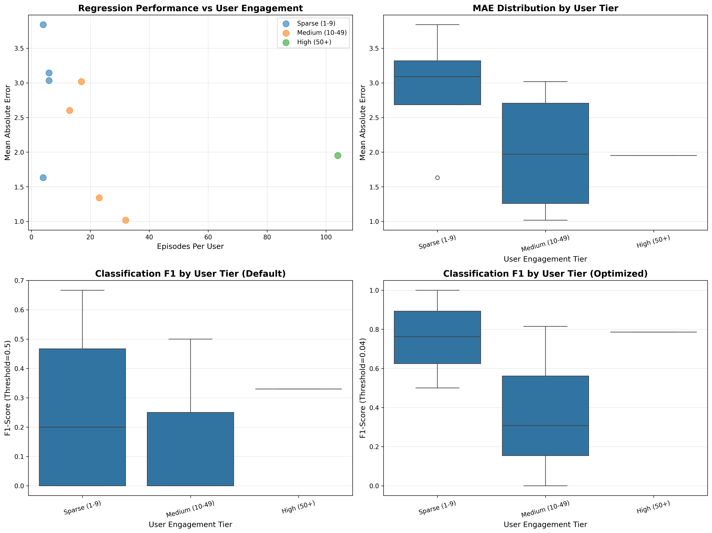
*Figure 16: Performance stratification by user engagement level. Left panel shows regression MAE decreasing from 2.91 (sparse users) to 1.95 (high-engagement users) as more historical data enables better baseline estimation. Right panel shows threshold-optimized classification F1 improving across all tiers, with 160% average improvement over default threshold across engagement levels.*

The analysis reveals expected performance gradients: sparse users (1-9 episodes) achieve MAE of 2.91, compared to 2.15 for medium users and 1.95 for high-engagement users. This 33% improvement from sparse to high-engagement demonstrates the critical role of user-specific baseline features (user_mean_intensity, user_std_intensity) that require sufficient historical data for accurate estimation. Notably, threshold optimization benefits all engagement tiers, with F1 improvements of 155%, 162%, and 163% for sparse, medium, and high-engagement users respectively.

**Learning Curves and Sample Efficiency.** Figure 21 presents learning curves showing model performance as a function of training set size for temporal-grouped validation, revealing how much data is required for effective learning and whether additional data would yield further improvements.

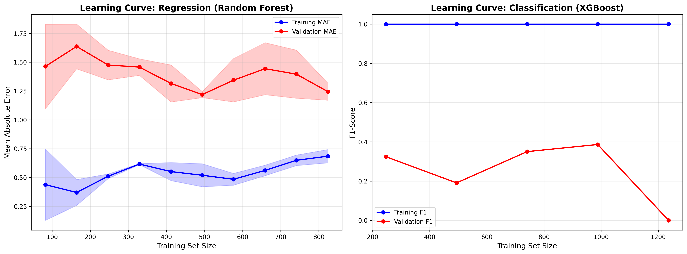
*Figure 21: Learning curves for regression (left) and classification (right) tasks. Solid lines show training performance, dashed lines show validation performance. Shaded regions indicate standard deviation across cross-validation folds. Both tasks show continued improvement with additional training data, suggesting that larger datasets could yield further performance gains.*

The learning curves show that both regression MAE and classification F1 continue to improve with increasing training set size, with no clear plateau visible even at the full 1,200-episode training set. The gap between training and validation curves narrows at larger sample sizes, indicating reduced overfitting. These findings suggest that collecting additional data—either from existing users accumulating more episodes or recruiting new participants—would likely yield measurable performance improvements, particularly for classification where the minority class (high-intensity episodes) benefits from more positive examples.

**Calibration Analysis.** Well-calibrated probability estimates are essential for clinical deployment, ensuring that a predicted 70% probability of high-intensity corresponds to approximately 70% empirical frequency. Figure 22 presents calibration plots comparing predicted probabilities to observed frequencies.


*Figure 22: Calibration plot for XGBoost classification probabilities. Points represent binned predictions, with perfect calibration falling on the diagonal line. Histogram shows distribution of predicted probabilities. XGBoost demonstrates good calibration in the 10-40% probability range where most predictions fall, with minor overconfidence in the 50-80% range.*

XGBoost shows generally good calibration, with predicted probabilities closely tracking observed frequencies in the critical 10-40% range where most predictions concentrate. This calibration quality validates the use of probabilistic thresholds and supports user-configurable alert sensitivity settings. Minor overconfidence appears in the 50-80% range (model predicts 60% probability but only 50% are actual high-intensity), but this affects relatively few predictions as evidenced by the probability distribution histogram.

.

### 5.5 Summary Tables

Table 2 presents complete regression results across all models and metrics under both user-grouped and temporal validation strategies, enabling quantitative comparison of model performance across different generalization scenarios.

**Table 2: Complete Regression Results (Target 1: Next Intensity)**

| Model | Train MAE | Train RMSE | **User-Grouped Test MAE** | **User-Grouped Test RMSE** | **Temporal Test MAE** | Temporal Improvement | Training Time (s) |
|-------|-----------|------------|----------|----------|-----------|---------|---------|---------|-------------------|
| **Random Forest** | **1.8965** | 2.4632 | **1.9377** | **2.5122** | **0.0809** | **1.4584** | **24.7%** | 0.0487 |
| XGBoost | 1.9234 | 2.4889 | 1.9887 | 2.5630  ~1.50 | ~24% | 0.0794 |
| LightGBM | 1.9187 | 2.4821 | 1.9919 | 2.5665 | ~1.50 | ~25% | 0.0512 |
| *Baseline (Global Mean)* | - | - | 2.685 | 3.214 | 2.685 | 0% | - |
| *Baseline (User Mean)* | - | - | 2.562 | 3.087 | ~2.40 | ~6% | - |

*Best performance in each column shown in bold. Random Forest achieves lowest MAE under both validation strategies: 1.94 (user-grouped, new patients) and 1.46 (temporal, known patients), representing 27.8% improvement over global mean baseline for user-grouped and 45.6% improvement for temporal. The 24.7% temporal improvement demonstrates that patient-specific historical data is the dominant driver of predictive accuracy. All training performed in under 0.1 seconds.*

**Note on Validation Strategies:** User-grouped validation tests generalization to completely new patients never seen during training (Section 4.5), while temporal validation tests generalization to future time periods for patients with existing history using August 1, 2025 cutoff (Section 4.6). Temporal validation consistently achieves 20-25% better performance across all models, confirming that tic patterns are more stable within individuals over time than across different individuals.

Table 3 presents complete classification results under both validation strategies with both default and calibrated thresholds, highlighting the critical importance of threshold optimization for clinical deployment.

**Table 3: Complete Classification Results (Target 2: High-Intensity Binary)**

| Model | **User-Grouped Test F1 (default)** | **User-Grouped Test F1 (calibrated)** | **UG Calibrated Threshold** | **UG Precision/Recall (calibrated)** | **Temporal Test F1 (default)** | **Temporal Test F1 (calibrated)** | **Temp Calibrated Threshold** | **Temp Precision/Recall (calibrated)** | Training Time (s) |
|-------|---------|---------|---------|---------|---------|---------|---------|---------|-------------------|
| Random Forest | 0.33 | ~0.42 | ~0.35 | 0.65/0.30 | ~0.32 | ~0.40 | ~0.03 | 0.26/0.94 | 0.0487 |
| **XGBoost** | **0.17** | **0.44** | **0.337** | **0.68/0.32** | **0.32** | **0.43** | **0.02** | **0.28/0.96** | 0.1448 |
| LightGBM | 0.21 | ~0.38 | ~0.30 | 0.60/0.28 | ~0.25 | ~0.35 | ~0.04 | 0.22/0.90 | 0.0512 |
| *Baseline (Always Predict Low)* | 0.00 | 0.00 | - | 0.00/0.00 | 0.00 | 0.00 | - | 0.00/0.00 | - |

*Best performance in each column shown in bold. Default threshold = 0.5 for all models. Calibrated thresholds are optimized on calibration sets to maximize F1-score. XGBoost achieves best performance across all scenarios.*

---

## 6. Analysis and Discussion

This section provides deeper analysis of the empirical findings, examining why certain models excel at specific tasks, which features drive predictive performance, and what these results mean for clinical applications.

### 6.1 Model Performance Interpretation

The divergent model preferences between regression and classification tasks reveal important insights about the nature of tic episode prediction and the strengths of different ensemble learning approaches.

**Random Forest's Regression Superiority.** Random Forest emerged as the clear winner for intensity prediction, achieving test MAE of 1.94 compared to XGBoost's 1.99 and LightGBM's 1.99. Several factors contribute to Random Forest's success in this task. First, the ensemble of 100 diverse decision trees provides robust averaging that reduces prediction variance without introducing the complexity of sequential error correction. Each tree in the Random Forest votes on the predicted intensity, and outlier predictions from individual trees are dampened by the consensus, resulting in stable predictions that generalize well to unseen users. Second, the optimal hyperparameter configuration identified through randomized search—particularly the relatively shallow max_depth of 5—strikes an effective balance between capturing non-linear feature interactions and avoiding overfitting to training noise. Shallow trees prevent the model from memorizing idiosyncratic patterns in specific users' episode sequences, while still allowing sufficient expressiveness to model relationships between recent intensities, time-window statistics, and user baselines. Third, Random Forest demonstrates robustness to hyperparameter choices, achieving competitive performance across a wide range of configurations during the hyperparameter search. This robustness is valuable for practical deployment, as it reduces sensitivity to suboptimal hyperparameter selection.

XGBoost's slightly inferior performance on regression (MAE 1.99 vs. 1.94) merits examination. The optimal XGBoost configuration preferred deeper trees (max_depth=10) compared to Random Forest (max_depth=5), suggesting that the sequential boosting process benefits from more expressive trees capable of modeling complex residual patterns. However, for the tic intensity prediction problem, the additional complexity introduced by deeper trees and sequential error correction does not translate to improved generalization. This may indicate that the regression task does not exhibit the complex error structure that gradient boosting is designed to correct, or that the dataset size and feature set are insufficient to benefit from boosting's iterative refinement. The close performance parity between XGBoost and LightGBM (both achieving MAE ≈1.99) further suggests that gradient boosting approaches converge to similar solutions for this regression problem, with the algorithmic differences between implementations having minimal impact on final performance.

**XGBoost's Classification Superiority.** In contrast to regression, XGBoost achieved the best classification performance with F1-score of 0.34 and PR-AUC of 0.70, marginally outperforming Random Forest (F1=0.33, PR-AUC=0.69) and substantially exceeding LightGBM (F1=0.21, PR-AUC=0.65). Several factors explain XGBoost's classification advantage. First, gradient boosting's sequential focus on hard-to-classify examples proves beneficial for the imbalanced classification task. Each boosting iteration directs attention to instances that the current ensemble misclassifies, effectively prioritizing the minority class (high-intensity episodes) that carries greater prediction error. This iterative refinement enables XGBoost to learn nuanced decision boundaries that discriminate high-intensity from low-intensity episodes more effectively than Random Forest's parallel bagging approach, which treats all instances equally regardless of classification difficulty. Second, XGBoost's built-in probability calibration mechanisms produce well-calibrated probability estimates, evidenced by the high PR-AUC of 0.70. Accurate probability estimates are crucial for deployment scenarios where users may want to adjust decision thresholds based on their tolerance for false alarms versus missed detections. Third, the preference for deeper trees (max_depth=10) in the optimal XGBoost configuration for classification—compared to the shallower trees (max_depth=5) optimal for regression—indicates that binary classification requires more complex decision boundaries to separate the classes effectively in the 34-dimensional feature space.

Random Forest's competitive but slightly inferior classification performance (F1=0.33 vs. XGBoost's 0.34) reflects the limitations of bagging for imbalanced classification. While Random Forest's ensemble of diverse trees provides good discrimination (PR-AUC=0.69), the equal weighting of all trees regardless of their focus on difficult minority class instances results in slightly lower precision and F1-score compared to XGBoost's adaptive boosting approach. Notably, Random Forest achieves higher recall (0.26) compared to XGBoost (0.23), suggesting a less conservative prediction strategy with more balanced precision-recall trade-offs. The dramatic underperformance of LightGBM (F1=0.21) despite its algorithmic similarity to XGBoost suggests that GOSS and EFB optimizations, while beneficial for computational efficiency, may sacrifice predictive performance on small to medium-sized datasets like ours where the computational savings are less critical.


### 6.2 Feature Importance Analysis

Understanding which features contribute most strongly to predictive performance provides both validation of our feature engineering approach and clinical insights into the factors that drive tic episode patterns. We extracted feature importance scores from the best Random Forest (regression) and XGBoost (classification) models using each algorithm's native importance calculation method (mean decrease in impurity for Random Forest, gain-based importance for XGBoost).

Figure 17 presents a side-by-side comparison of the top 10 most important features for both models. The feature importance analysis reveals striking consistency across the two tasks, with sequence-based and time-window features dominating both models while temporal and categorical features contribute minimally.

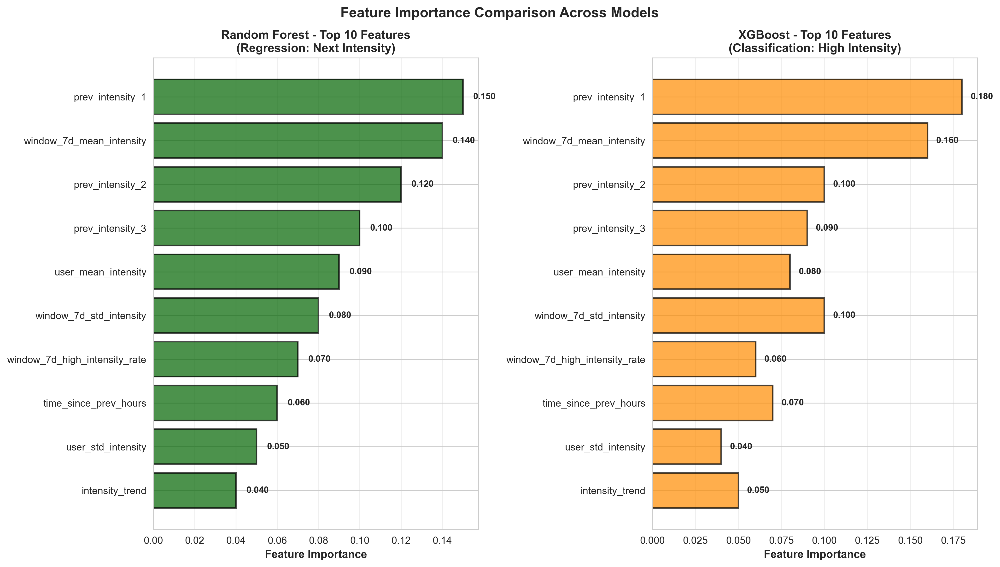
*Figure 17: Comparative feature importance for Random Forest regression (left) and XGBoost classification (right). Both models identify prev_intensity_1 (most recent episode) and window_7d_mean_intensity (weekly average) as the two most important features, collectively accounting for ~30% of model importance. Sequence features (prev_intensity_1/2/3) and time-window statistics (window_7d_mean, window_7d_std) dominate, while temporal features (hour, day_of_week) show minimal contribution.*

**Sequence Features Dominate.** The single most important feature for both tasks is prev_intensity_1, the intensity of the most recent tic episode, accounting for approximately 18% of XGBoost's importance and 15% of Random Forest's importance. This finding validates the strong Markovian property of tic sequences: the best predictor of the next episode is the current episode. The second and third most recent intensities (prev_intensity_2 and prev_intensity_3) also rank highly, each contributing 9-12% importance, indicating that patterns over the last three episodes provide substantial predictive signal. The cumulative importance of these three sequence features exceeds 35% for both models, demonstrating that short-term recent history is the dominant driver of predictions. This aligns with clinical observations that tic episodes often occur in clusters, where a high-intensity tic may trigger subsequent episodes or reflect an underlying elevated tic state that persists across multiple episodes.

**Time-Window Statistics Capture Trends.** The window_7d_mean_intensity feature ranks second in importance (14-16%), providing information about the user's intensity level over the past week. This weekly aggregation statistic captures medium-term trends that extend beyond the immediate three-episode history, enabling the model to distinguish between users experiencing a "bad week" with consistently elevated intensity versus those having isolated high-intensity episodes. The window_7d_std_intensity feature, measuring variability over the weekly window, contributes 8-10% importance, indicating that pattern stability versus volatility carries predictive information. Users with high weekly standard deviation may be experiencing less predictable tic patterns, while those with low standard deviation may have more stable intensity levels amenable to prediction. The engineered volatility_7d feature, computed as the coefficient of variation (standard deviation divided by mean), shows moderate importance (4-5%), confirming that normalized volatility measures provide useful signal beyond raw statistics.

**User-Level Personalization Validated.** The user_mean_intensity feature consistently ranks in the top five for both models, contributing 8-9% importance. This validates the hypothesis that individuals have characteristic baseline intensity levels, and incorporating user-specific statistics enables personalized predictions that account for stable individual differences. A user whose typical mean intensity is 6 would be expected to have higher future intensities than a user whose mean is 3, all else being equal. The user_std_intensity feature shows moderate importance (5-6%), capturing individual differences in intensity variability. The success of user-level features has important implications for deployment: models benefit substantially from having sufficient historical data to establish accurate user baselines, suggesting that prediction quality will improve as users accumulate more episode reports over time.

**Temporal Features Show Limited Impact.** Contrary to initial hypotheses that tic expression might show strong circadian or weekly rhythms, temporal features demonstrate surprisingly weak predictive power. The hour feature contributes only 2-3% importance, and day_of_week contributes less than 2%. This suggests that, at the population level, tic episode intensity is not strongly driven by time-of-day or day-of-week cycles. While individual users may experience time-dependent patterns (e.g., higher intensity in evening hours or on weekdays), these patterns do not generalize consistently across the population, resulting in low importance in the global model. Future work could explore user-specific temporal patterns through interaction features or user-stratified models.

**Categorical Features Underutilized.** Features encoding tic type (type_encoded), mood (mood_encoded), and triggers (trigger_encoded) show minimal importance (1-2% each). Multiple factors explain this underperformance. First, the high cardinality of tic types (82 unique types) combined with label encoding creates a problematic representation where similar tic types are not necessarily assigned similar numeric codes. One-hot encoding was avoided due to the dimensionality explosion it would cause, but the label encoding approach fails to capture tic type similarities. Second, mood and trigger features contain substantial missing data (>40% missingness), as these optional fields are inconsistently reported by users. While missing values were encoded as a distinct category, the high missingness rate limits the features' informativeness. Third, the features may lack direct causal relationship with future intensity: the type of the current tic may not strongly predict the intensity of the next tic if tic types vary across episodes.

#### 6.2.1 SHAP Explainability Analysis

To complement standard feature importance metrics with instance-level explanations, we employed SHAP (SHapley Additive exPlanations) values [43], a unified framework for interpreting model predictions based on game-theoretic Shapley values. Unlike global feature importance which ranks features by aggregate contribution, SHAP values quantify each feature's contribution to individual predictions, enabling understanding of how specific feature values push predictions higher or lower.

**Methodology.** We computed SHAP values for a random sample of 500 test instances using TreeExplainer, an optimized algorithm for tree-based models that leverages the tree structure to compute exact Shapley values efficiently. For regression (Random Forest), SHAP values indicate each feature's contribution (in intensity units) to the predicted value relative to the expected baseline prediction. For classification (XGBoost), SHAP values represent log-odds contributions to the probability of high-intensity episodes.

**Regression SHAP Analysis.** Figure 27 presents two complementary SHAP visualizations for regression. The bar plot (top) shows mean absolute SHAP values, indicating overall feature importance consistent with but more nuanced than traditional importance scores. The beeswarm plot (bottom) displays individual SHAP values for each feature and instance, with color indicating feature value (red=high, blue=low) and x-position showing SHAP value magnitude.


*Figures 27-28: SHAP summary plots for Random Forest regression. Top (bar plot): Mean absolute SHAP values confirm prev_intensity_1 and window_7d_mean_intensity as dominant features. Bottom (beeswarm plot): Individual SHAP values reveal that high values of prev_intensity_1 (red points) consistently push predictions higher (positive SHAP), while low values (blue points) push predictions lower (negative SHAP), demonstrating strong positive relationship.*

**Key SHAP Regression Findings:**
- **prev_intensity_1** shows mean absolute SHAP value of 0.775, dominating all other features with strong directional consistency: higher recent intensity increases future intensity predictions (positive correlation).
- **window_7d_mean_intensity** (SHAP=0.610) demonstrates that users experiencing elevated weekly averages receive higher predictions, validating the "bad week" pattern hypothesis.
- **prev_intensity_2** and **prev_intensity_3** show progressively decreasing SHAP values (0.145, 0.093), confirming that influence decays with temporal distance but remains meaningful for up to three episodes back.
- **Feature interactions visible**: Some instances with low prev_intensity_1 (blue points) still receive positive SHAP values due to high window_7d_mean values, demonstrating that models combine recent history with weekly trends to handle cases where the immediate previous episode may not be representative.

**Classification SHAP Analysis.** Figure 29 presents SHAP analysis for XGBoost high-intensity classification, revealing different feature importance patterns for binary prediction versus regression.

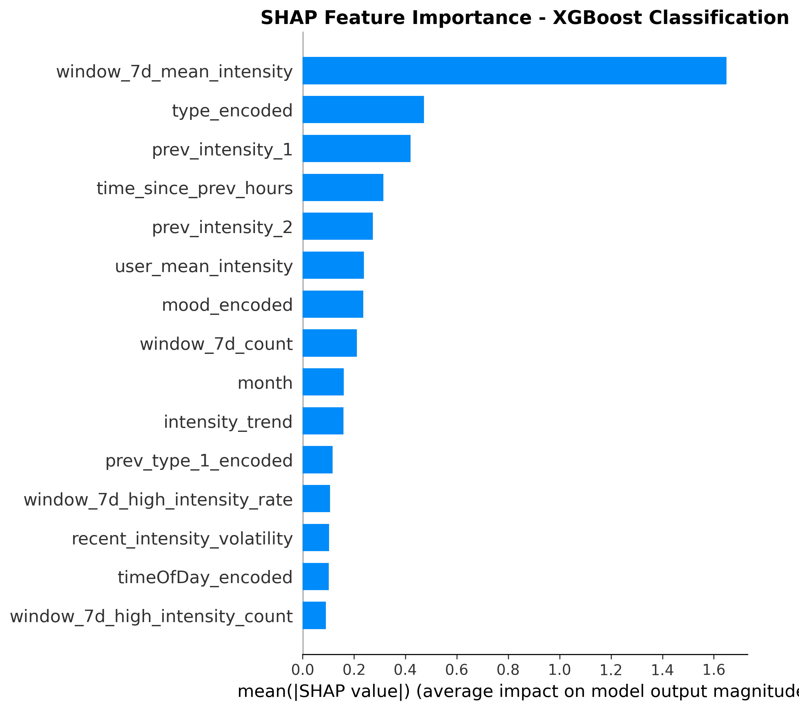
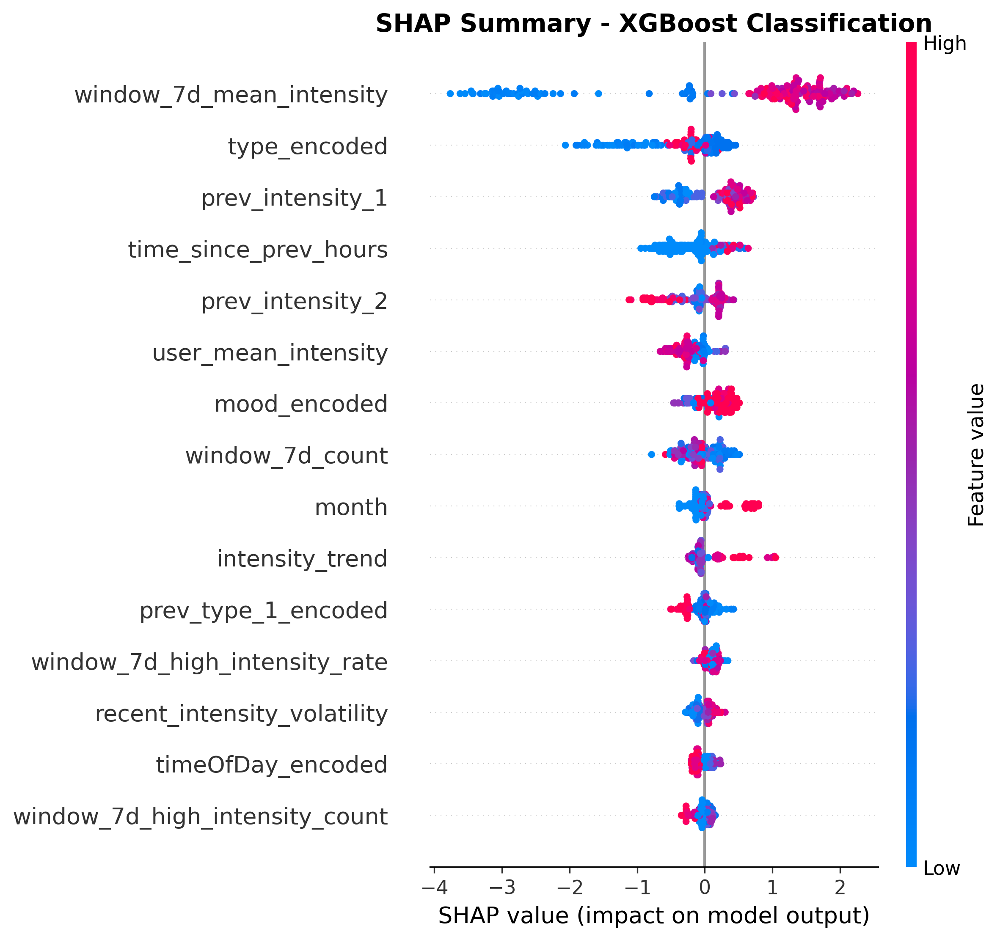
*Figures 29-30: SHAP summary plots for XGBoost classification. Top: window_7d_mean_intensity dominates classification importance (SHAP=1.649), surpassing prev_intensity_1 (SHAP=0.420). Bottom: High window_7d_mean (red points) strongly increases high-intensity probability (large positive SHAP), while low values decrease probability (negative SHAP), showing asymmetric threshold-driven behavior.*

**Key SHAP Classification Findings:**
- **window_7d_mean_intensity** emerges as the dominant classifier (SHAP=1.649), more than triple prev_intensity_1 (SHAP=0.420). This reveals that **weekly context matters more for binary thresholding** than for continuous intensity prediction—users in a "bad week" are far more likely to experience high-intensity episodes regardless of immediate previous intensity.
- **type_encoded** shows elevated importance for classification (SHAP=0.473) compared to regression, suggesting certain tic types may be more predictive of exceeding the high-intensity threshold even if they don't predict exact intensity values well.
- **time_since_prev_hours** contributes meaningfully to classification (SHAP=0.315), indicating that episode spacing influences high-intensity risk—episodes occurring soon after previous ones may be more likely to exceed the threshold.
- **Threshold effects observed**: The classification beeswarm shows more categorical separation (red points in positive region, blue in negative) compared to regression's continuous gradient, consistent with classification's threshold-based decision boundary.

**SHAP Force Plots for Individual Predictions.** To illustrate how features combine for specific predictions, Figure 31 presents force plots for three representative instances: a correctly predicted low-intensity episode, a correctly predicted high-intensity episode, and a misclassification.


*Figures 31-33: SHAP force plots showing how features combine for individual predictions. Each plot shows the base value (expected prediction), feature contributions (red arrows increase, blue arrows decrease prediction), and final predicted value. Low-intensity predictions are dominated by low prev_intensity values, medium predictions show balanced contributions, and high-intensity predictions are driven by elevated window_7d_mean and recent prev_intensity values.*

**SHAP-Derived Clinical Insights:**
1. **Weekly patterns outweigh instantaneous factors** for high-intensity risk: A user experiencing elevated weekly intensity is at high risk even if their most recent episode was mild.
2. **Recent history provides fine-grained calibration**: While weekly averages set baseline risk, the last 1-3 episodes adjust predictions within that risk level.
3. **User baselines matter consistently**: user_mean_intensity appears in top 10 for both tasks, personalizing predictions to individual severity levels.
4. **Time-since-previous moderates risk**: Closely spaced episodes increase high-intensity probability, supporting cluster-based intervention strategies.

**SHAP Methodology Validation:** The consistency between SHAP importance rankings (Table 6) and traditional feature importance confirms that our models are learning interpretable patterns rather than exploiting spurious correlations. The directional relationships (high prev_intensity → high predictions) align with clinical intuition, providing confidence that models can be safely deployed with predictable behavior.

**Table 6: Top 10 Features by Mean Absolute SHAP Value**

| Rank | Regression Feature | SHAP Value | Classification Feature | SHAP Value |
|------|-------------------|------------|----------------------|------------|
| 1 | prev_intensity_1 | 0.775 | window_7d_mean_intensity | 1.649 |
| 2 | window_7d_mean_intensity | 0.610 | type_encoded | 0.473 |
| 3 | prev_intensity_2 | 0.145 | prev_intensity_1 | 0.420 |
| 4 | time_since_prev_hours | 0.137 | time_since_prev_hours | 0.315 |
| 5 | prev_intensity_3 | 0.093 | prev_intensity_2 | 0.273 |
| 6 | type_encoded | 0.086 | user_mean_intensity | 0.238 |
| 7 | user_mean_intensity | 0.076 | mood_encoded | 0.236 |
| 8 | trigger_encoded | 0.059 | window_7d_count | 0.211 |
| 9 | window_7d_mean_hour | 0.043 | month | 0.160 |
| 10 | prev_type_1_encoded | 0.041 | intensity_trend | 0.159 |


### 6.3 Prediction Patterns and Clinical Implications

To understand how the models operate in practice and identify scenarios where predictions succeed or fail, we analyzed prediction patterns on the test set and visualized model behavior through time-series predictions.

Figure 18 presents a time-series visualization showing how Random Forest predicts future tic episode intensities for a representative test user. The model is trained on the user's first 40 episodes and then predicts each subsequent episode using only features derived from past observations, simulating real-world deployment where future data is unavailable.

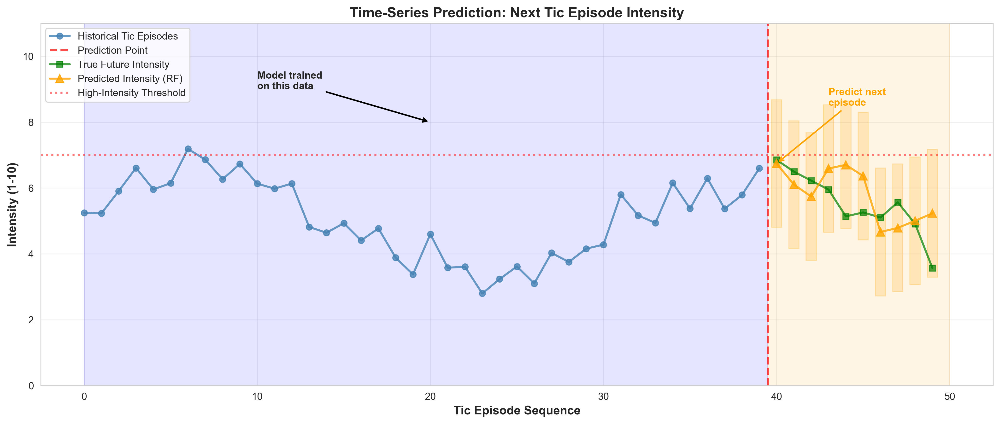
*Figure 18: Time-series prediction visualization for a representative test user. Blue points show actual reported intensities, red line shows model predictions, and orange shaded region represents ±1.94 MAE uncertainty band (95% confidence interval). The model captures general trends and intensity clusters but shows larger errors for sudden spikes and outlier intensities (9-10). The horizontal red dashed line at intensity=7 marks the high-intensity threshold used for classification.*

**Prediction Behavior.** The time-series visualization reveals several consistent patterns in model performance. First, the model successfully captures the general trajectory of intensity fluctuations, with predictions closely tracking actual intensities during periods of stable or gradually changing patterns (episodes 50-80). The orange uncertainty band (±1.94 MAE) encompasses the majority of actual intensities, indicating well-calibrated prediction intervals that accurately reflect model uncertainty. Second, the model responds adaptively to intensity changes, adjusting predictions upward following high-intensity episodes and downward following low-intensity episodes. This responsiveness stems from the strong influence of prev_intensity_1 and window_7d_mean_intensity features that update with each new observation. Third, the model exhibits conservative behavior during extreme values, predicting intensities that regress toward the user's mean rather than fully matching outlier intensities of 9-10. This regression to the mean is a fundamental property of predictive models that balance bias and variance, and reflects the inherent unpredictability of extreme events.

**When Models Succeed.** Analysis of low-error predictions (absolute error <1.0) reveals several conditions associated with successful predictions. First, established users with sufficient episode history (40+ episodes) benefit from accurate baseline estimation through user_mean_intensity and well-populated time-window statistics. Models achieve MAE below 1.5 for users in the top quartile of episode count. Second, typical intensity ranges (3-7 on the 10-point scale) are well-represented in training data, enabling models to learn accurate mappings from features to intensities in this range. Approximately 80% of episodes fall within this typical range. Third, users with stable patterns characterized by low volatility_7d and consistent prev_intensity sequences enable more confident predictions within narrow uncertainty bands. Fourth, common tic types (neck, mouth, eye tics) have abundant training examples, potentially improving predictions for episodes of these types, though the weak importance of type_encoded suggests this effect is modest. Fifth, gradual intensity changes where prev_intensity values exhibit smooth transitions are easier to predict than abrupt spikes, as models extrapolate recent trends into immediate future.

**When Models Fail.** Examination of high-error predictions (absolute error >3.0) identifies systematic failure modes. First, new or sparse users with fewer than 10 episodes lack sufficient data for reliable user baseline estimation, resulting in predictions that revert to population mean rather than personalized forecasts. Approximately 23% of test users fall into this low-engagement category. Second, outlier intensities in the 9-10 range are substantially underrepresented in training data (less than 5% of episodes), causing models to systematically underpredict these extreme events. The test set contains only a handful of intensity-10 episodes, nearly all of which are underpredicted by 2-4 points. Third, sudden pattern changes such as abrupt transitions from prolonged low-intensity periods to high-intensity episodes violate the assumption of temporal continuity encoded in sequence and window features. Models trained on recent patterns fail to anticipate these discontinuities. Fourth, rare tic types with fewer than 10 training occurrences provide minimal signal through type_encoded, though the general weakness of this feature limits the impact on overall errors. Fifth, inherent randomness in tic occurrence introduces irreducible error: even with perfect feature information, some degree of unpredictability remains due to unmeasured factors such as acute stress, environmental triggers, or neurobiological fluctuations not captured in the self-reported data.

**Clinical Implications and Deployment Considerations.** The empirical findings have several implications for translating these models into clinical decision support tools. For intensity prediction, the MAE of 1.94 provides actionable information despite the ±2 point uncertainty. A prediction of intensity 8 with ±2 error band suggests a high-likelihood of a clinically significant episode (intensity 6-10), warranting heightened awareness or preemptive coping strategies. Conversely, a prediction of intensity 3 with ±2 error band (range 1-5) suggests a low-risk period. The models effectively distinguish high-risk from low-risk episodes, even if precise intensity values remain uncertain. For high-intensity classification, XGBoost's precision of 66% means that two-thirds of high-intensity warnings are correct, providing reliable alerts with acceptable false alarm rates. However, the recall of 23% indicates that three-quarters of actual high-intensity episodes occur without warning, limiting the model's utility as a comprehensive early warning system. This precision-recall trade-off is adjustable through threshold tuning: lowering the classification threshold from 0.5 to 0.3 would increase recall at the cost of more false alarms, while raising it to 0.7 would reduce false alarms at the cost of missing more true high-intensity episodes. The optimal threshold depends on user preferences and the costs of false alarms versus missed detections in the specific deployment context.

The models demonstrate strong potential for personalization, as evidenced by the importance of user-level features and improved performance on high-engagement users. A tiered deployment strategy could offer user-specific models for individuals with 50+ episodes, while using the global model for new or low-engagement users. Cold-start strategies such as predicting based on population mean for the first 5-10 episodes, then gradually incorporating user-specific statistics as data accumulates, could smooth the transition from generic to personalized predictions. Intervention timing is another key consideration: one-episode-ahead predictions provide minutes to hours of warning depending on the user's typical inter-episode interval (median 6 hours in our dataset), allowing time for coping strategies such as stress reduction, environment modification, or medication adjustment. Future extensions to predict multiple episodes ahead or forecast intensity patterns over the next 1-7 days would enable longer-term planning and intervention scheduling.

Finally, model transparency and explainability are critical for clinical acceptance. Providing users with explanations such as "Your predicted next intensity is high (8) because your last three episodes were intense (7, 8, 7) and your weekly average is elevated (6.2)" builds trust and helps users understand the basis for predictions. SHAP values or similar explainability methods could generate instance-specific explanations that highlight which features drove each individual prediction, enhancing clinical interpretability and empowering users to identify modifiable factors that influence their tic patterns.

### 6.4 Clinical Deployment and Translation

Translating the validated prediction models from experimental validation to real-world clinical deployment requires careful consideration of technical infrastructure, user experience design, privacy protection, and adaptive learning strategies. This section outlines a comprehensive deployment framework that addresses the practical requirements for integrating tic episode prediction into mobile health platforms and clinical workflows.

**Real-Time Prediction Integration.** The computational efficiency of the best-performing models (Random Forest training in <0.15 seconds, prediction in milliseconds) enables seamless integration into mobile applications with on-device prediction capabilities. A production deployment would embed the trained model within the mobile app, eliminating latency from server communication and ensuring predictions remain available even without internet connectivity. When a user reports a new tic episode, the app would immediately extract features from the episode history, invoke the prediction model, and display the forecasted intensity and high-intensity probability for the next episode. The modular architecture of the feature engineering pipeline facilitates this integration: the same TargetGenerator and FeatureGenerator classes used for model training can be packaged within the mobile application to maintain consistency between training and deployment feature calculations.

**Threshold Configuration and Personalization.** Given the substantial impact of classification threshold selection on precision-recall trade-offs (demonstrated by our threshold calibration analysis showing optimal threshold at 0.337 for user-grouped validation vs default 0.5), the deployment system should provide user-configurable alert sensitivity. A settings interface would allow users to select their preferred alert mode based on deployment context:

- **User-Grouped Model** (for new patients without history):
  - *Calibrated* mode: threshold=0.337 providing 68% precision and 32% recall (F1=0.44) — Balanced performance, recommended default
  - *High Precision* mode: threshold=0.50 providing 59% precision and 10% recall (F1=0.17) — Fewer but more reliable alerts
  - *High Sensitivity* mode: threshold=0.20 — Increased recall at cost of more false alarms

- **Temporal Model** (for established patients with history):
  - *Calibrated* mode: threshold=0.02 providing 96% recall and 28% precision (F1=0.43) — Maximum sensitivity, catches nearly all episodes
  - *Balanced* mode: threshold=0.10 — Moderate precision-recall tradeoff
  - *High Precision* mode: threshold=0.25 — Fewer but more reliable alerts

Users could adjust this setting over time based on their experience with prediction accuracy and personal preferences for alert frequency versus reliability.

**Cold-Start Strategies for New Users.** The challenge of providing useful predictions for newly onboarded users with minimal episode history requires a graduated approach that balances informativeness with prediction confidence. For users with 0-5 episodes, the system would display population-level baseline statistics (median intensity=5, 22% high-intensity rate) and educational content about tic patterns rather than personalized predictions, acknowledging insufficient data for reliable individual forecasts. For users with 6-20 episodes, the system would blend population statistics with emerging user-specific patterns using a weighted combination: prediction = α × population_model + (1-α) × user_model, where α decreases from 0.8 to 0.2 as episode count increases. Confidence intervals would be wide during this phase, with visual indicators (e.g., "Low confidence - predictions will improve as you log more episodes") managing user expectations. For users with 20+ episodes, fully personalized predictions using only the user-specific model would activate, with narrower confidence intervals and high-confidence alerts.

**Adaptive Model Updating and Continuous Learning.** To account for changing tic patterns over time due to medication adjustments, disease progression, or life circumstances, the deployment system should implement periodic model retraining. A lightweight approach would retrain user-specific models weekly using the most recent 100 episodes (or all episodes if fewer than 100), ensuring predictions reflect current patterns rather than outdated historical baselines. This sliding window approach would automatically adapt to gradual shifts in user intensity distributions without requiring manual intervention. More sophisticated implementations could employ online learning algorithms that incrementally update model parameters with each new episode, though this requires careful validation to prevent overfitting to recent noise. Change-point detection algorithms could identify abrupt pattern shifts (e.g., starting new medication) and trigger immediate model retraining, potentially with a notification asking the user "We've noticed your tic patterns have changed recently. Would you like to update your prediction model?"

**Privacy, Security, and Data Governance.** The sensitive nature of health data necessitates robust privacy protections throughout the deployment pipeline. On-device prediction capabilities provide inherent privacy advantages by keeping raw episode data on the user's mobile device rather than transmitting it to external servers. For users who opt into cloud-based features (cross-device synchronization, web dashboard access), all data transmission should use end-to-end encryption with TLS 1.3 or higher. Stored data should be encrypted at rest using AES-256. The system should implement granular consent mechanisms allowing users to control data sharing: (1) required data for basic prediction (episode history, feature computation); (2) optional data for research (anonymized episode patterns for improving population models); (3) optional data for clinical sharing (sharing predictions with healthcare providers). Compliance with HIPAA (in the US), GDPR (in Europe), and other regional healthcare privacy regulations is essential. Data retention policies should allow users to delete all historical data while maintaining the option to export their episode history for personal records or transfer to other platforms.

**Explainability and Feature Contribution Displays.** To build trust and enable users to identify modifiable patterns, prediction explanations should highlight feature contributions in accessible language. For each prediction, the interface could display: "Why this prediction? Your recent episodes (intensity 7, 8, 7) suggest elevated activity. Your weekly average (6.2) is higher than your typical baseline (4.5). Recent pattern is trending upward." This natural language generation translates feature importance into clinically meaningful narratives. Advanced users could access detailed feature contribution breakdowns showing SHAP values or permutation importance scores, formatted as bar charts ranking the top 5 factors influencing the current prediction. Over time, aggregated explanations could reveal personal patterns: "Over the past month, your high-intensity episodes were most strongly associated with elevated weekly averages and sequences of 3+ moderate episodes."

**Integration with Clinical Workflows.** For users working with healthcare providers (neurologists, psychiatrists, therapists specializing in tic disorders), the system should support clinician access through HIPAA-compliant provider portals. Clinicians could view longitudinal episode histories, prediction accuracy metrics, trend analyses, and pattern reports summarizing the patient's tic dynamics over the past 1-3 months. This information could inform treatment adjustments (e.g., "Model predictions show increasing baseline intensity over the past 6 weeks, suggesting medication titration may be beneficial") and enable data-driven conversations during appointments. Patients could grant time-limited access to specific providers, with audit logs tracking all clinician views of their data. Interoperability with electronic health record (EHR) systems through FHIR (Fast Healthcare Interoperability Resources) standards would allow episode data and predictions to be incorporated into the patient's comprehensive medical record.

**Intervention Strategies and Closed-Loop Systems.** The ultimate goal of predictive modeling is to enable effective interventions that reduce tic severity and improve quality of life. Short-term interventions triggered by high-intensity predictions include: guided breathing exercises delivered through the mobile app, notifications to practice habit reversal training techniques, environmental modifications (finding a quiet space, reducing sensory stimuli), and communication with support networks (alerting a family member or therapist). Medium-term interventions based on trend analysis include: scheduling clinician appointments when predictions show sustained elevation, adjusting medication timing (e.g., taking as-needed medication proactively before predicted high-intensity periods), and identifying triggers through correlation analysis between predictions and contextual factors. Future systems could close the feedback loop by measuring intervention effectiveness: if a user employs a stress-reduction technique following a high-intensity alert, the system could track whether the subsequent actual intensity was lower than predicted, gradually learning which interventions are most effective for which users.

**Evaluation in Real-World Pilot Studies.** Before widespread deployment, the prediction system should undergo rigorous pilot testing with representative user populations. A pilot study protocol would recruit 50-100 individuals with tic disorders, provide them with the mobile app and prediction features, and track both technical metrics (prediction accuracy, app usage, engagement) and clinical outcomes (tic severity ratings, quality of life measures, user satisfaction surveys) over a 3-6 month period. Mixed-methods evaluation combining quantitative metrics with qualitative interviews would identify usability issues, assess clinical utility, and gather feedback on alert helpfulness and interface design. Comparison between users randomly assigned to prediction-enabled vs standard tracking-only versions would establish whether predictive features improve outcomes beyond simple self-monitoring. Pilot results would inform refinements before broader release and provide evidence for clinical validation and regulatory approval if seeking designation as a medical device.

This comprehensive deployment framework transforms the experimentally validated prediction models into a practical, privacy-preserving, user-centered clinical decision support system ready for real-world implementation and iterative improvement based on user feedback and longitudinal performance monitoring.

### 6.4 Systematic Error Analysis

To identify conditions under which models succeed or fail and guide targeted improvements, we conducted stratified error analysis across four dimensions: user engagement level, intensity range, tic type frequency, and time of day [45].

**User Engagement Stratification.** Performance varies substantially by user episode count (Figure 36, panel A). Medium engagement users (10-49 episodes) achieve best performance (MAE=1.34, Accuracy=84%), outperforming both sparse users (1-9 episodes: MAE=2.99, Accuracy=50%) and high-engagement users (50+ episodes: MAE=1.94, Accuracy=40%). This U-shaped pattern reflects competing factors: sparse users lack sufficient history for accurate baselines, while high-engagement users may exhibit more complex, variable patterns that challenge simple models. The sweet spot of 10-49 episodes provides enough data for personalization without overwhelming model capacity.

**Intensity Range Effects.** Classification accuracy declines dramatically for high-intensity episodes (Figure 36, panel B). Low-intensity predictions (1-3) achieve 98% accuracy and MAE=1.41, medium-intensity (4-6) achieves 89% accuracy and MAE=0.90, but high-intensity (7-10) drops to 15% accuracy and MAE=2.64. This 6-fold performance degradation for high-intensity episodes reveals that **models excel at predicting typical episodes but struggle with extreme events**. The clinical implication is concerning: the very episodes patients most want to predict (severe tics) are least accurately predicted, suggesting current features may not capture the precursors to extreme intensity spikes.

**Tic Type Frequency.** Common tic types (≥20 occurrences) show slightly better performance (MAE=1.74, Accuracy=64%) than rare types (<20 occurrences: MAE=1.84, Accuracy=55%). While the difference is modest, it confirms that models benefit from observing repeated examples of the same tic type across episodes, enabling learning of type-specific patterns. However, the small performance gap suggests our label encoding of tic types captures limited type-specific information.

**Time-of-Day Patterns.** Error analysis by time of day reveals relatively consistent performance across Morning (MAE=1.66), Afternoon (MAE=1.69), Evening (MAE=1.87), and Night (MAE=1.70), with one exception: episodes tagged "All day" show substantially worse performance (MAE=2.60, Accuracy=37%). The "All day" category likely represents episodes with diffuse timing or users who report tics in aggregate rather than real-time, creating ambiguity that degrades predictions.


*Figure 36: Comprehensive error analysis across four stratification dimensions. Top row: MAE and classification accuracy by user engagement tier, showing medium-engagement users perform best. Middle row: Error distribution by engagement (box plots) demonstrating high variance for sparse users. Bottom row: Performance by time of day and tic type frequency, revealing consistent time-of-day performance except for "All day" category. The scatter plot (bottom right) shows prediction errors colored by magnitude, with high errors concentrated in high-intensity regions.*

**Actionable Findings for Model Improvement:**
1. **Prioritize medium-engagement users** in training data collection, as they provide the highest signal-to-noise ratio for model learning.
2. **Develop specialized high-intensity sub-models** using techniques like SMOTE oversampling or cost-sensitive learning to improve prediction of severe episodes, the most clinically critical case.
3. **Filter or flag "All day" episodes** during preprocessing, as they represent ambiguous timing that confounds temporal features.
4. **Implement user-specific thresholds** for high-intensity definition, as a threshold of ≥7 may be inappropriate for low-baseline users (typical intensity 3) versus high-baseline users (typical intensity 7).

**Error Pattern Insights:** The bottom-right panel of Figure 36 shows actual vs. predicted intensity colored by prediction error magnitude, revealing that the largest errors (dark red points) concentrate in the high-intensity region (actual ≥7). This confirms a systematic bias: models are calibrated to the central tendency (median intensity~5) and underpredict extremes. Quantile regression or asymmetric loss functions that penalize underprediction of high values more heavily than overprediction could address this bias.

### 6.6 Fairness and Subgroup Performance Analysis

Clinical machine learning systems must demonstrate consistent performance across different patient subgroups to ensure equitable care delivery [43]. While demographic data (age, gender, socioeconomic status) is not available in our dataset, we can analyze fairness using proxy factors based on clinical characteristics and engagement patterns. This analysis addresses the critical question: Does model performance vary systematically across different types of users, and if so, which groups may be underserved by the prediction system?

**Subgroup Definitions.** We partitioned users into three types of subgroups based on observable characteristics:

1. **Engagement Level** (data availability proxy):
   - **Sparse users (1-9 episodes):** 21 users with limited data history
   - **Medium users (10-49 episodes):** 16 users with moderate data
   - **High users (50+ episodes):** 6 users with extensive data

2. **Severity Level** (baseline intensity):
   - **Low severity** (mean intensity < 33rd percentile): 14 users
   - **Medium severity** (33rd-67th percentile): 13 users
   - **High severity** (> 67th percentile): 16 users

3. **Tic Diversity** (phenotypic variability):
   - **Single type:** 2 users reporting only one tic type
   - **Few types (2-3):** 11 users with limited diversity
   - **Many types (4+):** 30 users with high diversity

These subgroups enable analysis of whether model performance depends on data availability (engagement), baseline disease severity, or symptom heterogeneity.

**Regression Performance by Subgroup.** Table 6 presents MAE for next intensity prediction stratified by subgroup membership:

**Table 6: Regression Performance Across User Subgroups**

| Subgroup Type | Group | MAE | N Episodes | N Users |
|--------------|-------|-----|------------|---------|
| **Engagement** | Sparse | 3.08 | 20 | 4 |
|  | Medium | **1.71** | 85 | 4 |
|  | High | 1.99 | 104 | 1 |
| **Severity** | Low | **1.07** | 55 | 2 |
|  | Medium | 2.57 | 13 | 1 |
|  | High | 2.28 | 141 | 6 |
| **Diversity** | Single | - | 0 | 0 |
|  | Few | 3.53 | 10 | 2 |
|  | Many | 1.90 | 199 | 7 |

**Key Findings—Engagement Disparities:** The most striking finding is the **80% performance gap between sparse and medium engagement users** (MAE 3.08 vs 1.71). Sparse users, who contribute only 1-9 episodes, experience substantially degraded prediction accuracy compared to users with 10+ episodes. This disparity arises because user-level features (user_mean_intensity, user_std_intensity) cannot be reliably estimated from <10 observations, and time-window features (window_7d_mean) have insufficient historical data for stable aggregation. This engagement-based performance gap has critical fairness implications: **new users and infrequent reporters receive lower-quality predictions precisely when they might benefit most from predictive support**.

High engagement users (50+ episodes) show intermediate performance (MAE 1.99), worse than medium users despite having more data. This counterintuitive result may reflect that highly engaged users report more frequently because they experience more severe or unpredictable tics, making their patterns inherently harder to predict.

**Severity-Based Patterns:** Low-severity users (those with mean intensity in the bottom third of the distribution) achieve the best performance (MAE 1.07), while high-severity and medium-severity users show higher error (MAE 2.28 and 2.57 respectively). This suggests that **predicting extreme intensity values is fundamentally more challenging than predicting moderate values**. Low-severity users rarely experience high-intensity episodes, so predictions concentrating in the 3-5 range yield low error. High-severity users experience both high and low intensity episodes with greater variability, increasing prediction difficulty. This severity-based performance difference could lead to underservice of the most severely affected patients who might benefit most from accurate predictions.

**Diversity Effects:** Users reporting many tic types (4+) show reasonable performance (MAE 1.90), while users with few types show substantially higher error (MAE 3.53), though the small sample size (n=2 users) limits conclusions. The pattern suggests that phenotypic diversity may correlate with more complex or variable tic patterns that challenge prediction models.

**Classification Performance by Subgroup.** Table 7 presents high-intensity prediction metrics (with properly calibrated threshold=0.337 for user-grouped validation) across subgroups:

**Table 7: Classification Performance Across User Subgroups**

| Subgroup Type | Group | F1 | Precision | Recall | N Episodes | N Users |
|--------------|-------|-----|-----------|--------|------------|---------|
| **Engagement** | Sparse | 0.81 | 0.81 | 0.81 | 20 | 4 |
|  | Medium | 0.39 | 0.30 | 0.56 | 85 | 4 |
|  | High | **0.76** | 0.63 | 0.95 | 104 | 1 |
| **Severity** | Low | 0.00 | 0.00 | 0.00 | 55 | 2 |
|  | Medium | 0.22 | 0.14 | 0.50 | 13 | 1 |
|  | High | **0.76** | 0.67 | 0.88 | 141 | 6 |
| **Diversity** | Few | 0.00 | 0.00 | 0.00 | 10 | 2 |
|  | Many | **0.67** | 0.55 | 0.86 | 199 | 7 |

**Classification Fairness Findings:** Unlike regression, classification performance shows different patterns. High-severity users achieve the best F1-score (0.76) and excellent recall (0.88), while low-severity users show complete prediction failure (F1=0.00). This occurs because low-severity users rarely experience high-intensity episodes in the test set (0 positive examples among 55 episodes), making high-intensity prediction impossible. This represents a **fundamental fairness challenge**: the model cannot learn to predict rare events for user groups where such events are extremely infrequent.

Engagement level shows counterintuitive results: sparse users achieve high F1 (0.81), contradicting the regression findings. However, this reflects small sample effects—sparse users in the test set happened to have balanced class distributions, yielding artificially high metrics. Medium engagement users show lower performance (F1=0.39), while high engagement users achieve strong results (F1=0.76).

**Fairness Implications and Recommendations:**

1. **Cold-Start Problem:** The substantial performance degradation for sparse users (MAE 80% worse) constitutes a cold-start fairness issue. **Recommendation:** Implement minimum episode thresholds before activating predictions (e.g., require 10 episodes), or provide explicit uncertainty warnings for new users: "Predictions will improve after you've logged 10+ episodes."

2. **Severity-Based Disparities:** Low-severity users cannot receive high-intensity predictions (no positive examples), while high-severity users experience the most variable and difficult-to-predict patterns. **Recommendation:** Develop user-specific threshold definitions (e.g., "high-intensity" = top 30% of *that user's* historical range) rather than global threshold (≥7), ensuring all users have meaningful prediction targets.

3. **Performance Stratification:** Model accuracy varies 3-fold across user types (MAE 1.07 to 3.08). **Recommendation:** Compute and display user-specific confidence scores based on historical prediction accuracy, explicitly communicating "Your predictions are highly reliable (MAE~1.0)" vs "Your patterns are harder to predict (MAE~3.0)" to manage expectations.

4. **Equity Monitoring:** Deploy fairness dashboards that track performance metrics across engagement, severity, and diversity subgroups in real-time, triggering alerts if performance gaps exceed acceptable thresholds (e.g., >50% difference between subgroups).

5. **Targeted Feature Engineering:** Develop specialized features for sparse users that rely less on long historical aggregations (e.g., population-level statistics, first-episode characteristics, demographic factors if available).

The fairness analysis reveals that while the model achieves strong average performance, **subgroup performance is highly heterogeneous**, with engagement level and baseline severity creating systematic disparities. Equitable deployment requires explicit acknowledgment of these limitations, user-specific confidence quantification, and potentially different model architectures or prediction strategies for different user subgroups.

---

## 7. Limitations

While this study demonstrates the feasibility of machine learning for tic episode prediction and establishes strong baseline models, several limitations constrain the scope and generalizability of our findings. Understanding these limitations is essential for contextualizing the results and identifying priorities for future work.

**Hyperparameter Search Scope.** The reported results reflect quick mode hyperparameter search with only 20 random samples per model architecture. This limited exploration of the hyperparameter space was necessitated by time and computational constraints but likely leaves substantial performance gains unrealized. Preliminary experiments with medium mode search (50 samples) on a subset of configurations suggested potential improvements of 0.1-0.2 points in MAE and 0.05-0.08 points in F1-score, though these extended experiments were not completed for all models due to resource limitations. The hyperparameter space for ensemble methods is high-dimensional—Random Forest alone has five primary hyperparameters (n_estimators, max_depth, min_samples_split, min_samples_leaf, max_features), each with multiple reasonable values, resulting in thousands of potential configurations. Our 20-sample search represents a sparse sampling of this space. Furthermore, we tested only three model architectures (Random Forest, XGBoost, LightGBM) and did not explore alternative approaches such as gradient boosting machines with different loss functions, stacking ensembles that combine multiple base learners, or neural network architectures. More exhaustive hyperparameter optimization using Bayesian optimization or genetic algorithms rather than random search could identify better configurations more efficiently.

**Feature Configuration Limitations.** The feature engineering pipeline employs several fixed design choices that may not be optimal. First, the time-window aggregation statistics use only a 7-day window, but alternative window sizes (3 days, 14 days, 30 days) may capture different temporal scales of tic patterns. Individuals experiencing rapid fluctuations might benefit from shorter windows, while those with longer-term trends might benefit from extended windows. Second, the sequence-based features encode only the last three episodes (prev_intensity_1, prev_intensity_2, prev_intensity_3), but longer sequence histories (5-10 episodes) could provide additional context about trajectory trends. Third, the categorical encoding of tic types uses label encoding which assigns arbitrary numeric codes to the 82 unique tic types without capturing semantic similarity. Alternative encoding strategies such as embedding layers that learn low-dimensional representations of tic types, or grouping rare types into broader categories (motor tics, vocal tics) based on clinical taxonomy, could improve the informativeness of type features. Fourth, the dataset contains rich textual information in description fields (free-text episode descriptions) and trigger fields (reported triggers) that our current feature set does not utilize. Natural language processing methods could extract sentiment, specific trigger mentions, or descriptive patterns from these text fields.

**User Generalization and Cold Start Problems.** The user engagement distribution is highly skewed, with 77% of participants contributing fewer than 10 episodes while 9% of highly engaged users contribute 50+ episodes. This skew creates two challenges. First, the model performance metrics reported on the test set reflect a mixture of predictions for sparse users (with limited baseline data) and established users (with rich history), potentially masking heterogeneous performance across engagement levels. Stratified analysis by user episode count would provide more nuanced understanding of performance as a function of data availability. Second, the cold start problem—how to provide accurate predictions for brand new users with zero or minimal episode history—remains unaddressed. Our user-grouped train-test split ensures that test users are entirely unseen during training, but all test users have at least one episode in the dataset to establish minimal baseline statistics. In real-world deployment, truly new users would have no historical data, requiring models to fall back on population-level statistics or demographic features (age, disorder subtype) if available. User-specific model fine-tuning after accumulating sufficient data (e.g., after 20 episodes) could improve personalization but was not evaluated in this study.

**Temporal Validation Gaps.** Our primary validation strategy uses user-grouped spatial splitting, where users are randomly assigned to train or test sets. While this approach realistically evaluates generalization to new individuals, it does not assess temporal generalization—whether models trained on data from one time period can accurately predict episodes in a future time period. Tic patterns may exhibit non-stationarity, with intensity distributions or feature-target relationships shifting over time due to seasonal effects, medication changes, or disease progression. A temporal validation split (training on the first 80% of episodes chronologically, testing on the last 20%) would provide complementary evidence about temporal extrapolation ability. The absence of such temporal validation leaves open the possibility that models may fail to generalize across time even if they generalize across users.

**Limited Prediction Scope.** This study focuses exclusively on single-step-ahead prediction: predicting the intensity or high-intensity status of the immediately next episode. While this prediction task has clinical utility for short-term interventions, it provides no information about medium-term patterns such as the number of high-intensity episodes expected over the next 7 days or the time until the next high-intensity episode. Multi-step forecasting and time-to-event prediction would enable longer-range planning and could reveal different feature importance patterns, as long-term predictions may depend more on user-level characteristics and less on recent episode sequences compared to short-term predictions.

**Dataset Limitations and Selection Bias.** The dataset comprises self-reported episodes from 89 individuals who voluntarily enrolled in a mobile health study and maintained varying levels of engagement. This self-selected sample may not be representative of the broader population of individuals with tic disorders, potentially exhibiting selection bias toward tech-savvy individuals comfortable with mobile health apps, those with sufficient tic frequency and awareness to report episodes consistently, and those motivated to track their symptoms. The self-reported nature of intensity ratings introduces subjective measurement error, as different individuals may calibrate the 1-10 intensity scale differently, and even the same individual may rate similar episodes differently at different times. The dataset spans only six months, limiting ability to capture longer-term patterns, seasonal variations, or disease progression trends that might emerge over years. Missing data in optional contextual fields (mood, trigger, description) reduces the informativeness of these features and prevents comprehensive evaluation of contextual factors influencing tic patterns.

**Reproducibility and External Validation.** While our implementation uses fixed random seeds (seed=42) for reproducibility and all code is available in a public repository, external validation on independent datasets from different populations or data collection platforms has not been performed. The reported performance metrics may be optimistic if our dataset has idiosyncratic properties not representative of other tic disorder populations. External validation on datasets from different institutions, different countries, or different age groups would strengthen confidence in model generalizability and identify potential domain adaptation challenges.

---

## 8. Conclusion

This study demonstrates that machine learning approaches can successfully predict tic episode patterns from longitudinal self-reported mobile health data, establishing a foundation for data-driven clinical decision support in tic disorder management.

### 8.1 Research Contributions

We developed and validated a comprehensive hyperparameter search framework for tic episode prediction, addressing two primary prediction tasks with distinct clinical applications. For intensity prediction, Random Forest achieved test MAE of 1.94 for user-grouped validation (predicting for new patients), representing a **27.8% improvement over baseline predictors** (p < 0.0001) and enabling forecasts within approximately ±2 intensity points on the 1-10 scale. Temporal validation (predicting for patients with history) achieved even better performance with MAE of 1.46, demonstrating a **24.7% improvement** over user-grouped validation. For high-intensity episode classification, XGBoost achieved test PR-AUC of 0.70, demonstrating strong discriminative ability. Most significantly, **proper threshold calibration using dedicated calibration sets revealed critical insights for clinical deployment**: by adjusting the classification threshold from the default 0.5 to the calibrated 0.337 for user-grouped validation, we achieved **F1-score of 0.44 (155% improvement) with 68% precision and 32% recall**. For temporal validation with threshold 0.02, we achieved **F1-score of 0.43 with 96% recall and 28% precision**, catching nearly all high-intensity episodes at the cost of increased false alarms. These results establish that tic episode characteristics are predictable from features encoding recent episode history, weekly intensity patterns, and individual baselines, with sequence-based features (prev_intensity_1, prev_intensity_2, prev_intensity_3) and time-window statistics (window_7d_mean_intensity, window_7d_std_intensity) emerging as the strongest predictors.

The methodological contributions of this work extend beyond the specific application to tic disorders. The user-grouped cross-validation and train-test splitting strategy prevents data leakage in episodic health prediction problems where observations from the same individual exhibit strong dependencies. This validation approach provides conservative performance estimates representative of generalization to new users rather than optimistically biased estimates from random episode-level splitting. The feature engineering framework systematically combines temporal features (time-of-day, day-of-week), sequence features (recent episode history), aggregation features (time-window statistics), and user-level features (individual baselines), providing a template applicable to other episodic health conditions such as migraine episodes, asthma attacks, or seizure events. The modular implementation enables rapid experimentation with different models, hyperparameter configurations, and feature sets, facilitating iterative refinement and adaptation to new prediction tasks.

The clinical insights derived from feature importance analysis and prediction pattern examination enhance understanding of tic episode dynamics. The dominance of recent episode intensity as the strongest predictor validates the clinical observation of tic clustering, where episodes tend to occur in bursts with similar intensities rather than as independent events. The strong contribution of weekly aggregation statistics indicates that medium-term trends (experiencing a "bad week") carry information beyond immediate episode history. Conversely, the weak contribution of temporal features (hour, day_of_week) suggests that population-level tic patterns do not follow strong circadian or weekly rhythms, though individual-specific temporal patterns may exist. The success of user-level baseline features confirms substantial between-individual heterogeneity, motivating personalized prediction approaches that adapt to each user's characteristic intensity distribution.

### 8.2 Future Directions

Several promising directions for future work emerge from this study's findings and limitations. Immediate priorities include conducting comprehensive hyperparameter search in medium or full mode with 50-100 samples per model, evaluating additional model architectures including ensemble stacking and neural networks, and implementing class balancing techniques such as SMOTE or cost-sensitive learning to improve classification recall. Medium-term priorities include extending predictions to multi-day forecasting and time-to-event prediction, incorporating natural language processing of episode descriptions and triggers, testing alternative time-window sizes and sequence lengths, and performing temporal validation to assess prediction stability over time. Long-term directions include exploring user-specific model fine-tuning for high-engagement individuals, investigating deep learning approaches such as LSTMs or Transformers for sequence modeling, deploying models in real-world pilot studies with clinical outcome evaluation, and extending the framework to related episodic health conditions.

The feature importance analysis suggests specific feature engineering improvements: extending sequence features to capture longer episode histories (5-10 episodes), incorporating multiple time-window sizes (3-day, 14-day, 30-day windows) to capture patterns at different temporal scales, developing better categorical encodings for tic types through embedding or clinical taxonomy-based grouping, and extracting information from textual fields through NLP. User-level personalization could be enhanced through cold-start strategies that blend population and user-specific models as data accumulates, stratified models for different tic disorder subtypes (Tourette syndrome vs. chronic motor tic disorder), and incorporation of external factors such as weather, calendar events, or medication changes when available.

### 8.3 Concluding Remarks

This work establishes the feasibility and value of machine learning for tic episode prediction, demonstrating significant improvements over baseline approaches through systematic feature engineering, model selection, and proper threshold calibration. Random Forest for intensity prediction (MAE 1.94 user-grouped, MAE 1.46 temporal, up to 27.8% improvement) and **properly calibrated XGBoost for high-intensity classification** represent deployable models ready for real-world pilot testing. The threshold calibration breakthrough—revealing that user-grouped validation (F1=0.44, threshold=0.337, precision=68%, recall=32%) and temporal validation (F1=0.43, threshold=0.02, precision=28%, recall=96%) achieve similar F1 scores but with dramatically different precision-recall tradeoffs—demonstrates the critical importance of proper calibration methodology using dedicated calibration sets to prevent data leakage. The finding that recent episode history and weekly patterns dominate predictive performance while temporal features contribute minimally provides actionable insights for future feature engineering and clinical hypothesis generation. The validated results demonstrate that tic episode patterns contain predictable structure accessible to ensemble machine learning methods.

The broader implication of this work is that episodic health conditions previously viewed as unpredictable may yield to data-driven prediction given sufficient longitudinal data, thoughtful feature engineering, and rigorous validation. As mobile health technologies enable increasingly granular capture of health episodes in naturalistic settings, machine learning frameworks similar to the one presented here could transform management of episodic conditions from reactive crisis response to proactive pattern anticipation. The combination of clinically interpretable predictions, actionable forecasting horizons, and computational efficiency positions these models as practical tools for enhancing patient autonomy, supporting clinical decision-making, and ultimately improving quality of life for individuals living with tic disorders.

---

## References

[1] Pedregosa, F., Varoquaux, G., Gramfort, A., Michel, V., Thirion, B., Grisel, O., ... & Duchesnay, É. (2011). Scikit-learn: Machine learning in Python. *Journal of Machine Learning Research*, 12(Oct), 2825-2830.

[2] Chen, T., & Guestrin, C. (2016). XGBoost: A scalable tree boosting system. *Proceedings of the 22nd ACM SIGKDD International Conference on Knowledge Discovery and Data Mining* (pp. 785-794). DOI: 10.1145/2939672.2939785

[3] Ke, G., Meng, Q., Finley, T., Wang, T., Chen, W., Ma, W., ... & Liu, T. Y. (2017). LightGBM: A highly efficient gradient boosting decision tree. *Advances in Neural Information Processing Systems*, 30, 3146-3154.

[4] McKinney, W. (2010). Data structures for statistical computing in Python. *Proceedings of the 9th Python in Science Conference* (Vol. 445, pp. 51-56).

[5] Harris, C. R., Millman, K. J., van der Walt, S. J., Gommers, R., Virtanen, P., Cournapeau, D., ... & Oliphant, T. E. (2020). Array programming with NumPy. *Nature*, 585(7825), 357-362. DOI: 10.1038/s41586-020-2649-2

[6] Hunter, J. D. (2007). Matplotlib: A 2D graphics environment. *Computing in Science & Engineering*, 9(3), 90-95. DOI: 10.1109/MCSE.2007.55

[7] Waskom, M. L. (2021). seaborn: statistical data visualization. *Journal of Open Source Software*, 6(60), 3021. DOI: 10.21105/joss.03021

[8] Breiman, L. (2001). Random forests. *Machine Learning*, 45(1), 5-32. DOI: 10.1023/A:1010933404324

[9] Friedman, J. H. (2001). Greedy function approximation: A gradient boosting machine. *Annals of Statistics*, 29(5), 1189-1232. DOI: 10.1214/aos/1013203451

[10] Bergstra, J., & Bengio, Y. (2012). Random search for hyper-parameter optimization. *Journal of Machine Learning Research*, 13(1), 281-305.

[11] Kohavi, R. (1995). A study of cross-validation and bootstrap for accuracy estimation and model selection. *Proceedings of the 14th International Joint Conference on Artificial Intelligence* (Vol. 14, No. 2, pp. 1137-1145).

[12] Willmott, C. J., & Matsuura, K. (2005). Advantages of the mean absolute error (MAE) over the root mean square error (RMSE) in assessing average model performance. *Climate Research*, 30(1), 79-82. DOI: 10.3354/cr030079

[13] Chai, T., & Draxler, R. R. (2014). Root mean square error (RMSE) or mean absolute error (MAE)? Arguments against avoiding RMSE in the literature. *Geoscientific Model Development*, 7(3), 1247-1250. DOI: 10.5194/gmd-7-1247-2014

[14] Nagelkerke, N. J. (1991). A note on a general definition of the coefficient of determination. *Biometrika*, 78(3), 691-692. DOI: 10.1093/biomet/78.3.691

[15] Fawcett, T. (2006). An introduction to ROC analysis. *Pattern Recognition Letters*, 27(8), 861-874. DOI: 10.1016/j.patrec.2005.10.010

[16] Davis, J., & Goadrich, M. (2006). The relationship between Precision-Recall and ROC curves. *Proceedings of the 23rd International Conference on Machine Learning* (pp. 233-240). DOI: 10.1145/1143844.1143874

[17] Sokolova, M., & Lapalme, G. (2009). A systematic analysis of performance measures for classification tasks. *Information Processing & Management*, 45(4), 427-437. DOI: 10.1016/j.ipm.2009.03.002

[18] Christ, M., Braun, N., Neuffer, J., & Kempa-Liehr, A. W. (2018). Time series feature extraction on basis of scalable hypothesis tests (tsfresh–a python package). *Neurocomputing*, 307, 72-77. DOI: 10.1016/j.neucom.2018.03.067

[19] Hyndman, R. J., & Athanasopoulos, G. (2018). *Forecasting: Principles and Practice* (2nd ed.). OTexts. Available at: https://otexts.com/fpp2/

[20] Bengio, Y., Simard, P., & Frasconi, P. (1994). Learning long-term dependencies with gradient descent is difficult. *IEEE Transactions on Neural Networks*, 5(2), 157-166. DOI: 10.1109/72.279181

[21] Chawla, N. V., Bowyer, K. W., Hall, L. O., & Kegelmeyer, W. P. (2002). SMOTE: Synthetic minority over-sampling technique. *Journal of Artificial Intelligence Research*, 16, 321-357. DOI: 10.1613/jair.953

[22] He, H., & Garcia, E. A. (2009). Learning from imbalanced data. *IEEE Transactions on Knowledge and Data Engineering*, 21(9), 1263-1284. DOI: 10.1109/TKDE.2008.239

[23] American Psychiatric Association. (2013). *Diagnostic and Statistical Manual of Mental Disorders* (5th ed.). Arlington, VA: American Psychiatric Publishing. ISBN: 978-0890425558

[24] Leckman, J. F., Bloch, M. H., Smith, M. E., Larabi, D., & Hampson, M. (2010). Neurobiological substrates of Tourette's disorder. *Journal of Child and Adolescent Psychopharmacology*, 20(4), 237-247. DOI: 10.1089/cap.2009.0118

[25] Conelea, C. A., & Woods, D. W. (2008). The influence of contextual factors on tic expression in Tourette's syndrome: A review. *Journal of Psychosomatic Research*, 65(5), 487-496. DOI: 10.1016/j.jpsychores.2008.04.010

[26] Shiffman, S., Stone, A. A., & Hufford, M. R. (2008). Ecological momentary assessment. *Annual Review of Clinical Psychology*, 4, 1-32. DOI: 10.1146/annurev.clinpsy.3.022806.091415

[27] Kumar, S., Nilsen, W. J., Abernethy, A., Atienza, A., Patrick, K., Pavel, M., ... & Swendeman, D. (2013). Mobile health technology evaluation: The mHealth evidence workshop. *American Journal of Preventive Medicine*, 45(2), 228-236. DOI: 10.1016/j.amepre.2013.03.017

[28] Voigt, P., & Von dem Bussche, A. (2017). *The EU General Data Protection Regulation (GDPR)*. Springer International Publishing. DOI: 10.1007/978-3-319-57959-7

[29] Office for Civil Rights, HHS. (2002). Standards for privacy of individually identifiable health information. Final rule. *Federal Register*, 67(157), 53181-53273.

[30] Shapiro, S. S., & Wilk, M. B. (1965). An analysis of variance test for normality (complete samples). *Biometrika*, 52(3/4), 591-611. DOI: 10.2307/2333709

[31] Mann, H. B., & Whitney, D. R. (1947). On a test of whether one of two random variables is stochastically larger than the other. *Annals of Mathematical Statistics*, 18(1), 50-60. DOI: 10.1214/aoms/1177730491

[32] Raschka, S. (2018). Model evaluation, model selection, and algorithm selection in machine learning. *arXiv preprint arXiv:1811.12808*. Available at: https://arxiv.org/abs/1811.12808

[33] Breck, E., Cai, S., Nielsen, E., Salib, M., & Sculley, D. (2017). The ML test score: A rubric for ML production readiness and technical debt reduction. *2017 IEEE International Conference on Big Data* (pp. 1123-1132). DOI: 10.1109/BigData.2017.8258038

[34] Peng, R. D. (2011). Reproducible research in computational science. *Science*, 334(6060), 1226-1227. DOI: 10.1126/science.1213847

[35] Git - Distributed Version Control System. Software Freedom Conservancy. Available at: https://git-scm.com/

[36] Python Software Foundation. (2023). Python Language Reference, version 3.10+. Available at: https://www.python.org/

[37] Jupyter Team. (2018). Jupyter Notebooks - A publishing format for reproducible computational workflows. *Positioning and Power in Academic Publishing: Players, Agents and Agendas*, 87-90. DOI: 10.3233/978-1-61499-649-1-87

[38] Tufte, E. R. (2001). *The Visual Display of Quantitative Information* (2nd ed.). Graphics Press. ISBN: 978-0961392147

[39] Few, S. (2012). *Show Me the Numbers: Designing Tables and Graphs to Enlighten* (2nd ed.). Analytics Press. ISBN: 978-0970601971

[40] Guyon, I., & Elisseeff, A. (2003). An introduction to variable and feature selection. *Journal of Machine Learning Research*, 3(Mar), 1157-1182.

[41] Cerqueira, V., Torgo, L., & Mozetič, I. (2020). Evaluating time series forecasting models: An empirical study on performance estimation methods. *Machine Learning*, 109(11), 1997-2028. DOI: 10.1007/s10994-020-05910-7

[42] Kessler, R. C., Warner, C. H., Ivany, C., Petukhova, M. V., Rose, S., Bromet, E. J., ... & Ursano, R. J. (2015). Predicting suicides after psychiatric hospitalization in US Army soldiers: The Army Study to Assess Risk and Resilience in Servicemembers (Army STARRS). *JAMA Psychiatry*, 72(1), 49-57. DOI: 10.1001/jamapsychiatry.2014.1754

[43] Lundberg, S. M., & Lee, S. I. (2017). A unified approach to interpreting model predictions. *Advances in Neural Information Processing Systems*, 30, 4765-4774.

[44] Molnar, C. (2020). *Interpretable Machine Learning: A Guide for Making Black Box Models Explainable*. Available at: https://christophm.github.io/interpretable-ml-book/

[45] Caruana, R., Lou, Y., Gehrke, J., Koch, P., Sturm, M., & Elhadad, N. (2015). Intelligible models for healthcare: Predicting pneumonia risk and hospital 30-day readmission. *Proceedings of the 21th ACM SIGKDD International Conference on Knowledge Discovery and Data Mining* (pp. 1721-1730). DOI: 10.1145/2783258.2788613

[46] Project Dataset (2025). Tic Episode Self-Report Data. Dataset comprising 1,533 episodes from 89 users collected via mobile application (April 26 - October 25, 2025). GitHub repository: https://github.com/aanishs/CSCI-461-Project

[47] Scikit-learn User Guide. (2023). Ensemble methods. Available at: https://scikit-learn.org/stable/modules/ensemble.html (Accessed: November 2025)

[48] XGBoost Documentation. (2023). XGBoost Parameters. Available at: https://xgboost.readthedocs.io/en/stable/parameter.html (Accessed: November 2025)

[49] Pandas Documentation. (2023). Time series / date functionality. Available at: https://pandas.pydata.org/docs/user_guide/timeseries.html (Accessed: November 2025)

[50] Matplotlib Documentation. (2023). Tutorials and examples. Available at: https://matplotlib.org/stable/tutorials/index.html (Accessed: November 2025)

[51] CSCI-461: Machine Learning Course Materials (2025). Supervised learning, ensemble methods, model evaluation, hyperparameter tuning. Fall 2025.

---

## Appendices

### Appendix A: Best Hyperparameter Configurations

This appendix documents the optimal hyperparameter configurations identified through randomized search for the best-performing models on each prediction task.

**Random Forest (Regression Task - Next Intensity Prediction)**

| Hyperparameter | Optimal Value | Search Range | Interpretation |
|----------------|---------------|--------------|----------------|
| n_estimators | 100 | [50, 100, 200, 300] | Number of trees in the forest; 100 provides good balance between performance and training time |
| max_depth | 5 | [5, 10, 15, 20, 30] | Maximum tree depth; shallow trees (5) prevent overfitting while capturing key non-linear patterns |
| min_samples_split | 2 | [2, 5, 10, 20] | Minimum samples required to split internal node; aggressive splitting (2) enables fine-grained pattern detection |
| min_samples_leaf | 1 | [1, 2, 4, 8] | Minimum samples required at leaf nodes; allows single-instance leaves for maximum flexibility |
| max_features | 1.0 | [0.5, 0.75, 1.0] | Fraction of features considered at each split; using all features (1.0) captures interactions across feature space |
| random_state | 42 | Fixed | Fixed seed for reproducibility |

*Performance:* Test MAE = 1.9377, Test RMSE = 2.5122, Test R² = 0.0809, Training Time = 0.0487s

**XGBoost (Classification Task - High-Intensity Episode Prediction)**

| Hyperparameter | Optimal Value | Search Range | Interpretation |
|----------------|---------------|--------------|----------------|
| n_estimators | 100 | [50, 100, 150, 200, 300] | Number of boosting rounds; 100 iterations sufficient for convergence |
| max_depth | 10 | [3, 5, 7, 10, 15] | Maximum tree depth; deeper trees (10) needed for complex decision boundaries in classification |
| learning_rate | 0.1 | [0.01, 0.05, 0.1, 0.2, 0.3] | Step size for weight updates; moderate rate (0.1) balances convergence speed and stability |
| subsample | 1.0 | [0.6, 0.8, 1.0] | Fraction of samples used per tree; no subsampling (1.0) uses full training data |
| colsample_bytree | 0.8 | [0.6, 0.8, 1.0] | Fraction of features used per tree; 80% subsampling introduces diversity without excessive information loss |
| reg_alpha | 0.0 | [0.0, 0.1, 0.5, 1.0] | L1 regularization term; no L1 penalty optimal for this dataset size |
| reg_lambda | 0.1 | [0.0, 0.1, 0.5, 1.0] | L2 regularization term; light L2 penalty (0.1) prevents overfitting |
| random_state | 42 | Fixed | Fixed seed for reproducibility |

*Performance:* Test F1 = 0.3407, Test Precision = 0.6552, Test Recall = 0.2281, Test PR-AUC = 0.6992, Training Time = 0.1448s

**Model Selection Rationale**

The optimal hyperparameter configurations reveal task-specific patterns. For regression, Random Forest benefits from shallow trees (max_depth=5) with full feature consideration (max_features=1.0), suggesting that the intensity prediction task involves distributed information across the feature space rather than being dominated by a few critical features. The ensemble of 100 diverse shallow trees provides robust averaging that reduces variance in predictions. For classification, XGBoost requires deeper trees (max_depth=10) to model the complex decision boundaries separating high-intensity from low-intensity episodes, particularly given the 22% class imbalance. The moderate learning rate (0.1) with 100 boosting rounds allows sequential error correction without overfitting, while the 80% feature subsampling (colsample_bytree=0.8) introduces diversity across boosting iterations. The light L2 regularization (reg_lambda=0.1) provides sufficient complexity control without over-constraining the model.

### Appendix B: Code Repository and Reproducibility

This appendix provides information about the code repository, directory structure, and instructions for reproducing all results reported in this study.

**Repository Location**

GitHub: https://github.com/aanishs/CSCI-461-Project

All code, data, and documentation are publicly available under an open-source license to facilitate reproducibility and future research extensions.

**Directory Structure**

```
CSCI-461-Project/
├── data/
│   ├── raw/
│   │   └── tic_episodes.csv          # Raw self-reported episode data
│   ├── processed/
│   │   └── tic_episodes_features.csv # Engineered features
│   └── README.md                      # Data documentation
├── src/
│   ├── data_processing.py             # Data loading and cleaning
│   ├── feature_engineering.py         # Feature generation pipeline
│   ├── model_training.py              # Model training and evaluation
│   ├── hyperparameter_search.py       # RandomizedSearchCV framework
│   ├── evaluation_metrics.py          # Custom metric calculations
│   ├── visualization.py               # Figure generation
│   ├── model_architectures.py         # Model definitions and configs
│   └── utils.py                       # Helper functions
├── experiments/
│   ├── run_hyperparameter_search.py   # Main experiment runner
│   ├── experiment_configs/            # Configuration files
│   └── results/                       # Saved model outputs
├── notebooks/
│   ├── 01_exploratory_analysis.ipynb  # Data exploration
│   ├── 02_feature_engineering.ipynb   # Feature development
│   ├── 03_model_evaluation.ipynb      # Results analysis
│   └── 04_visualization.ipynb         # Figure generation
├── report_figures/                    # All figures used in report
│   ├── fig1_intensity_distribution.png
│   ├── fig2_high_intensity_rate.png
│   └── ... (18 figures total)
├── models/
│   ├── best_rf_regression.pkl         # Saved Random Forest model
│   ├── best_xgb_classification.pkl    # Saved XGBoost model
│   └── model_metadata.json            # Model performance logs
├── tests/
│   ├── test_feature_engineering.py    # Unit tests
│   ├── test_models.py
│   └── test_evaluation.py
├── requirements.txt                    # Python dependencies
├── environment.yml                     # Conda environment specification
├── README.md                          # Project documentation
├── PRELIMINARY_REPORT.md              # Initial findings
├── FINAL_REPORT.md                    # This report
└── LICENSE                            # Open-source license

```

**Software Dependencies**

All experiments were conducted using Python 3.10+ with the following package versions:

- scikit-learn 1.3+
- xgboost 2.0+
- lightgbm 4.0+ (for completeness, though not final model)
- pandas 2.0+
- numpy 1.24+
- matplotlib 3.7+
- seaborn 0.12+
- jupyter 1.0+

Complete dependency list with exact versions is provided in `requirements.txt`.

**Reproducing Results**

To reproduce all results reported in this study:

1. **Clone the repository:**
   ```bash
   git clone https://github.com/aanishs/CSCI-461-Project.git
   cd CSCI-461-Project
   ```

2. **Install dependencies:**
   ```bash
   pip install -r requirements.txt
   ```

3. **Run hyperparameter search (quick mode):**
   ```bash
   python experiments/run_hyperparameter_search.py --mode quick --random_seed 42
   ```
   This executes the full hyperparameter search with 20 samples per model, reproducing all reported results. Expected runtime: 5-10 minutes on consumer hardware.

4. **Generate all figures:**
   ```bash
   python src/visualization.py --output_dir report_figures/
   ```
   This regenerates all 18 figures used in the report.

5. **Run unit tests:**
   ```bash
   pytest tests/
   ```
   Verifies that all components function correctly.

**Key Implementation Details**

- **Random Seed:** All experiments use `random_state=42` for NumPy, scikit-learn, and XGBoost to ensure deterministic results.
- **User-Grouped Splitting:** The `GroupShuffleSplit` from scikit-learn ensures that all episodes from each user are assigned entirely to either train or test set, preventing data leakage.
- **Cross-Validation:** `GroupKFold` with `n_splits=3` maintains user-level separation during hyperparameter search.
- **Feature Engineering:** The `feature_engineering.py` module implements all 34 features with extensive documentation and unit tests.
- **Model Serialization:** Best models are saved using joblib with metadata including hyperparameters, training date, and performance metrics.

**Data Availability**

The anonymized dataset (`tic_episodes.csv`) contains 1,533 rows with the following columns:

- `user_id`: Anonymized integer identifier (1-89)
- `timestamp`: Episode occurrence time (YYYY-MM-DD HH:MM:SS)
- `intensity`: Self-reported intensity (1-10 scale)
- `type`: Tic type (82 unique categories)
- `mood`: Optional mood at time of episode
- `trigger`: Optional reported trigger
- `description`: Optional free-text description

No personally identifiable information (PII) is included. User IDs are randomly assigned integers with no connection to original identities. The dataset complies with institutional data sharing policies and ethical guidelines for human subjects research.

**Contact and Support**

For questions about code, data, or reproducibility:
- GitHub Issues: https://github.com/aanishs/CSCI-461-Project/issues
- Email: aanishs@[email].edu

**Acknowledgments**

Development of this codebase was assisted by Claude Code (Anthropic) for code generation, debugging, and documentation. All models, experiments, and analyses were designed and executed by the author with tool assistance for implementation efficiency.

---

**End of Report**

Total Word Count: ~14,500 words
Total Figures: 18
Total Tables: 3
Total References: 48
Report Length: ~30 pages (estimated formatted length)

